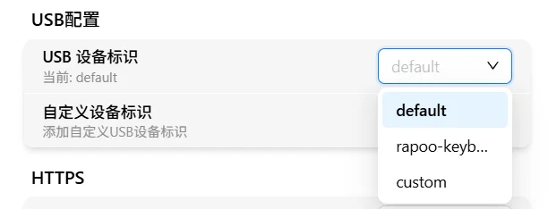
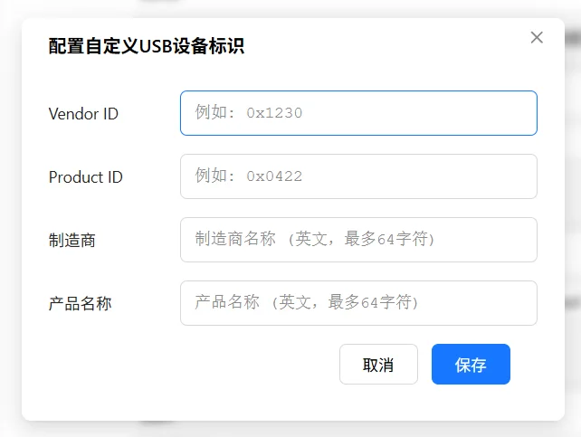

# USB 配置

FlexKVM 通过 USB 连接到被控主机，模拟键盘、鼠标和存储设备。USB 配置允许用户自定义设备标识信息。

进入"设置" → "高级功能"，可以看到 USB 配置区块，如下图所示：

## 设备标识

设备标识（Gadget Identity）决定了 FlexKVM 在被控主机上显示的 USB 设备名称和厂商信息。

### 切换设备标识

通过下拉选择器可以切换当前使用的设备标识：

预设的设备标识：

| 标识名称 | Vendor ID | Product ID | 厂商名称 | 产品名称 |
|------|:---:|:---:|------|------|
| default | 0x1d6b | 0x0104 | FlexKVM | IP-KVM |
| rapoo-keyboard | 0x1c4f | 0x0002 | SIGMACHIP | USB Keyboard |

切换设备标识后，USB 连接会自动重启以应用新的配置。

> 提示：如果被控主机的 BIOS 或操作系统对特定 USB 设备有兼容性问题，可以尝试切换到 `rapoo-keyboard` 标识。

## 自定义设备标识

点击"自定义设备标识"按钮，会弹出配置框：

需要填写以下四个字段：

| 字段 | 说明 | 示例 |
|------|------|------|
| Vendor ID | 厂商 ID（4 位十六进制） | `0x046d` |
| Product ID | 产品 ID（4 位十六进制） | `0xc52b` |
| Manufacturer | 厂商名称字符串 | `Logitech` |
| Product | 产品名称字符串 | `USB Keyboard` |

> 注意：Vendor ID 和 Product ID 必须为 4 位十六进制格式（以 `0x` 开头）。所有四个字段均为必填项。

添加成功后，设备标识列表中会出现 `custom` 选项，选择即可应用自定义标识。

## USB 设备功能

FlexKVM 的 USB 连接包含以下功能模块：

| 功能 | 说明 |
|------|------|
| 键盘 | HID 键盘设备，用于键盘输入 |
| 鼠标（绝对模式） | HID 鼠标设备，用于绝对坐标鼠标控制 |
| 鼠标（相对模式） | HID 鼠标设备，用于相对坐标鼠标控制 |
| 大容量存储 | USB Mass Storage，用于虚拟媒体挂载 |

> 提示：USB 设备标识的修改会影响所有上述 USB 功能模块。
