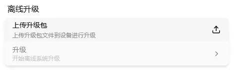

# 离线升级

进入"设置" → "升级"

区块内包含两个卡片：

- 上传镜像
- 升级

## 上传镜像

点击上传，选择 OTA 镜像文件。上传时卡片下方显示进度条：

> OTA 镜像文件命名为 `xxxxx.tar`，上传时注意文件名。

上传成功后，升级卡片从灰色变为可用。

## 升级

点击升级，弹出上传包验证框：

验证框显示镜像文件的 SHA-256 校验值。确认固件无误后，点击升级，弹出用户验证框：

- 输入密码
- 如已开启 2FA，需输入验证码

验证通过后显示升级进度：

升级成功后显示提示：

> 升级期间请保持电源稳定，断电可能导致升级失败。升级完成后设备自动重启。
>
> OTA 升级只能升级到更高版本，不支持降级和同级升级。

- 升级过程中，OLED 显示升级图标，🔴 警告灯快速闪烁
- 升级完成后，🔴 警告灯常亮，设备重启
