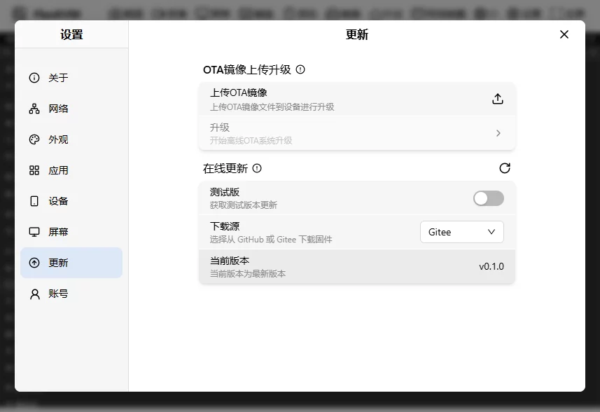
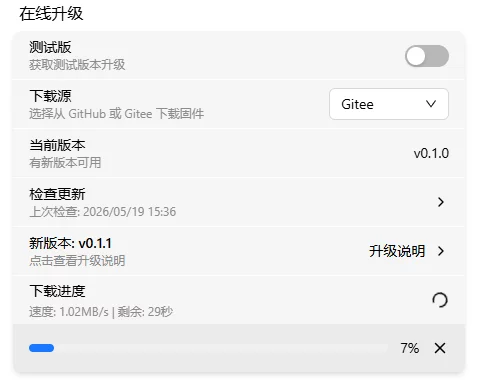
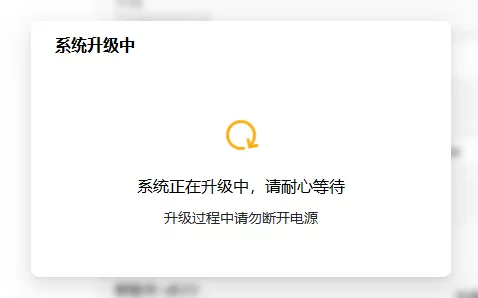
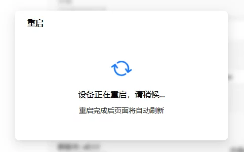

# 在线升级

进入"设置" → "升级"。

## 升级前准备

| 准备项   | 要求                                               |
| ---------- | ---------------------------------------------------- |
| 电源稳定 | **建议使用独立电源适配器供电**，避免升级过程中断电 |
| 网络稳定 | 下载过程中断开会导致下载失败                       |
| 设备空闲 | 升级期间设备会重启，请勿进行其他操作               |

> 升级过程中断电可能导致设备变砖，需通过 TTL 串口恢复。请务必确保电源稳定。

在线升级为第二个区块，默认包含四个卡片：

- 测试版选择
- 下载源选择
- 当前版本
- 检查更新

检查到新版本后，增加两个卡片：

- 测试版
- 下载源
- 当前版本
- 检查更新
- 新版本
- 下载安装包 & 立即升级

## 测试版

测试版用于体验新功能和 Bug 修复，但可能不稳定。

> 测试版固件不建议在生产环境使用。

## 下载源

选择固件下载地址：

- [GitHub](https://github.com/chutuotek/flexkvm/releases)
- [Gitee](https://gitee.com/chutuotek/flexkvm/releases)

> 中国境内用户建议选择 Gitee，下载速度更快。

## 当前版本

显示当前使用的固件版本号，例如 `v0.1.0`。

## 检查更新

点击"检查更新"按钮检查新版本。

> 系统不会主动检查更新，需手动点击。下载前请确认是否为最新版本。

## 新版本

检查到新版本后，新增新版本卡片（如 `v0.1.1`）。

点击查看更新日志：

网络不佳时，更新日志变为链接，点击在浏览器中查看。

## 下载安装包 & 立即升级

未下载时点击"下载安装包"，显示下载进度：

下载完成后校验固件，校验通过后变为"立即升级"：

点击"立即升级"，需验证用户信息：

输入密码（如已开启 2FA 还需验证码），验证通过后开始升级：

升级成功：

> 升级期间请保持电源稳定，断电可能导致升级失败。升级完成后设备自动重启。

- 升级过程中，OLED 显示升级图标，🔴 警告灯快速闪烁
- 升级完成后，🔴 警告灯常亮，设备重启
