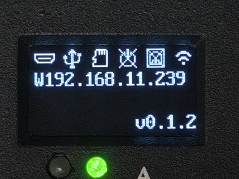

# 存储管理

FlexKVM 通过 TF 卡（MicroSD）提供本地存储扩展，支持文件管理、虚拟光驱和 USB 导出功能。常用于：

- 将系统安装镜像共享为虚拟光驱，给被控主机重装系统
- 在 TF 卡和被控主机之间传输文件

---

## TF 卡规格

| 项目 | 要求 |
|------|------|
| 卡类型 | MicroSD（TF）卡 |
| 文件系统 | FAT32 / exFAT / ext4 / NTFS |

## 安装

TF 卡槽位于设备侧面，在电源灯的下方。

装入时请确保 TF 卡的金属触点朝向电源灯，推入听到咔嗒声即可。

> 接口电气规格请参考 [接口说明](../product/interface.md#tf-卡槽)。

## 确认状态



TF 卡插入后，OLED 屏幕上的存储图标会显示已连接。

> 如果插入后图标没有变化，请检查 TF 卡是否能正常使用，或尝试重新插拔。

## 软件配置

在 Web 界面菜单栏中可以看到镜像相关的图标，点击可管理 TF 卡和 USB 共享。


### 镜像按键

| 图标 | 含义 |
|------|------|
|  | TF 卡已插入 |
|  | TF 卡未插入 |
|  | 正在通过 USB 共享给被控主机 |

存储管理支持四种用法：

- **整盘共享**：将整张 TF 卡作为 U 盘共享给被控主机
- **分区共享**：将 TF 卡的某个分区作为 U 盘共享给被控主机
- **分区挂载**：在 FlexKVM 上挂载分区，浏览和传输文件
- **单文件共享**：将单个 ISO/IMG 文件作为虚拟光驱共享给被控主机

### 整盘共享

将整张 TF 卡作为 U 盘共享给被控主机，被控主机能看到卡上的所有分区。

在选择分区中选中 TF 卡，点击"共享"即可。


> 设置共享只读后，被控主机只能读取共享的存储设备，不能写入。

### 分区共享

只共享 TF 卡的某个分区给被控主机，其他分区不会被看到。适合只想暴露特定分区（如 exFAT）的场景。

在选择分区中选中目标分区，点击"共享"即可。


> 设置共享只读后，被控主机只能读取共享的存储设备，不能写入。

### 分区挂载

在选择分区中选中 TF 卡的一个分区，点击"挂载"，FlexKVM 会挂载该分区，之后可以浏览和管理文件。


挂载后可以看到以下内容：

- **共享只读**：共享时生效，开启后被控主机只能读取不能写入。
- **挂载信息**：分区总大小和已用大小，旁边有上传和卸载按钮。
- **文件列表**：刷新后可更新文件内容和分区大小。选中文件后可进行操作。
- **操作按钮**：删除、下载、共享文件。

> 有些分区格式可能不支持挂载，如果挂载失败，请尝试使用其他分区格式。

### 单文件共享

需要先将分区挂载，然后选中一个文件，点击"共享文件"，被控主机会将这个文件识别为虚拟光驱。


> 支持大于 4 GB 的文件共享，但文件格式必须是 `.img` 或 `.iso`，其他格式无法作为光驱共享。

### 安全移除

| 当前状态 | 操作步骤 |
|---------|---------|
| 单文件共享 | 先取消共享，再卸载分区，最后拔出 TF 卡 |
| 整盘/分区共享 | 先取消共享，再拔出 TF 卡 |
| 已挂载但未共享 | 先卸载分区，再拔出 TF 卡 |
| 已插入但未操作 | 直接拔出 |

---

## 场景

### 场景一：给被控主机重装系统

```
插入 TF 卡 → 选分区 → 点击"挂载" → 上传 .iso 镜像 → 勾选镜像 → 点击"共享文件" → 被控主机从光驱启动
```

> 上传速度较慢，建议提前将镜像放入 TF 卡中。
>
> **注意**：系统安装过程中请勿开关鼠标、键盘或音频功能，否则 USB 会短暂断开，导致安装中断或失败。
>
> 安装完成后请取消共享光驱，再按[安全移除](#安全移除)步骤拔出 TF 卡。

### 场景二：在 TF 卡和被控主机之间传文件

```
插入 TF 卡 → 选分区 → 点击"挂载" → 上传文件 或 勾选文件下载
```

---

## 常见问题

**TF 卡插上没反应？**
→ 检查文件系统是否支持。FAT32 和 exFAT 兼容性最好。

**共享的光驱被控主机不识别？**
→ 确认文件是 `.img` 或 `.iso` 格式。其他格式无法作为光驱共享。

**上传到一半断了？**
→ 刷新页面后重新上传，断点续传暂不支持。

**系统安装到一半失败了？**
→ 检查安装过程中是否开关过鼠标、键盘或音频功能，这些操作会导致虚拟光驱短暂断开。

---

[:octicons-arrow-left-24: 返回用户指南](../index.md)
