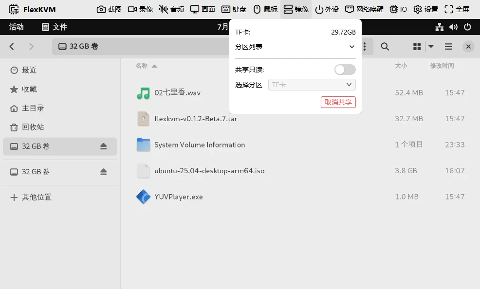
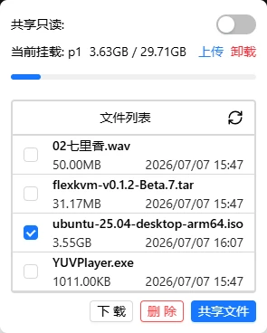
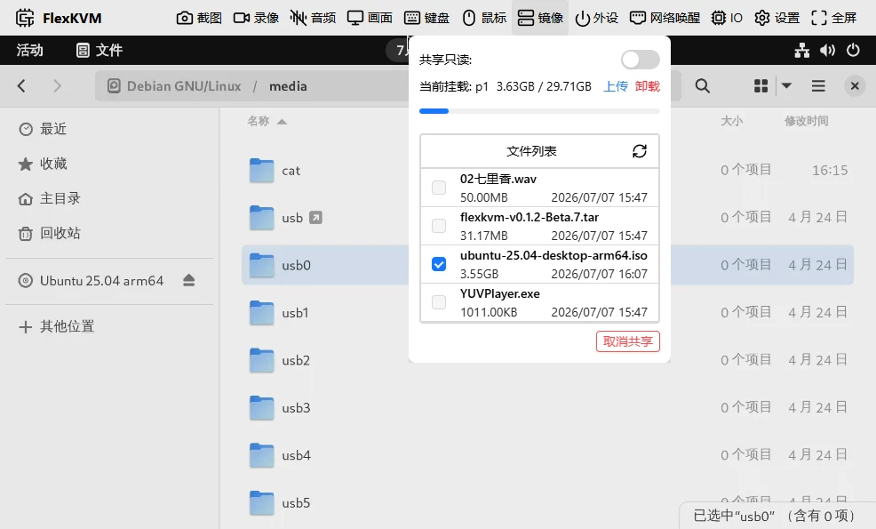

# ISO 镜像挂载

将 TF 卡中的文件挂载到 FlexKVM，或通过 USB 共享给被控主机使用。常用于：

- 将系统安装镜像共享为虚拟光驱，给被控主机重装系统
- 在 TF 卡和被控主机之间传输文件


如果没有看到硬盘图标，点击后会显示"TF卡: 未插入"。

## 镜像按键

| 图标 | 含义 |
|------|------|
|  | TF 卡已插入 |
|  | TF 卡未插入 |
|  | 正在进行 USB 共享 |

> TF 卡规格与安装请参考 [TF 卡与存储](../storage/tf-card.md)。

## 操作指南

disk一般有四种功能用法：

- 整盘共享
- 分区共享
- 分区挂载
- 单文件共享

**共享**：将文件系统或者文件共享给被控主机，被控主机识别为 U 盘或光驱。
**挂载**：将文件系统挂载到 FlexKVM，可以管理文件，进行文件传输等操作。

### 整盘共享

将选择分区设置为TF卡,点击"共享"，这时候会将这个TF卡共享给被控主机，相当于将整个TF卡通过读卡器连接到被控主机中。



> 设置共享只读后，被控主机只能读取共享的存储设备，不能写入。

### 分区共享

将选择分区设置为TF卡的一个分区，点击"共享"，这时候会将这个分区共享给被控主机，相当于将这个分区通过读卡器连接到被控主机中。


> 设置共享只读后，被控主机只能读取共享的存储设备，不能写入。

### 分区挂载

将选择分区设置为TF卡的一个分区，点击"挂载"，这时候会将这个分区挂载到FlexKVM中，可以管理文件，文件传输等。



可以看到有四部分内容：

- 共享只读：用来设置共享的文件系统是否只读，如果开启，被控主机只能读取共享的存储设备，不能写入。
- 挂载信息及相关控件：分区的总大小，当前已用大小，旁边会有上传和卸载按键。
- 文件列表：上部分有刷新的按键，刷新之后可以更新当前的文件内容和分区大小，下半部分显示当前挂载的文件系统中的文件，选中之后可以进行文件操作。
- 操作按钮: 选择文件之后可以对文件进行操作，删除，下载，共享。

> 有些分区格式可能不支持挂载，如果挂载失败，请尝试使用其他分区格式。

### 单文件共享

需要先将分区进行挂载，然后选中一个文件，点击"共享文件"，这时候会将这个文件共享给被控主机，相当于将这个文件通过读卡器连接到被控主机中。



> 支持大于4G的文件共享，但是需要将文件格式设置为`.img`或`.iso`格式，其他格式无法作为光驱共享。

## 场景

### 场景一：给被控主机重装系统

```
插入TF卡 → 选分区 → 点击"挂载" → 上传 .iso 镜像 → 勾选镜像 → 点击"共享文件" → 被控主机从光驱启动
```

> 上传的速度会比较慢，建议提前将镜像放入TF卡中。
>
> **注意**：系统安装过程中请勿开关鼠标、键盘或音频功能，否则 USB 会短暂断开，导致安装中断或失败。

### 场景二：在 TF 卡和被控主机之间传文件

```
插入TF卡 → 选分区 → 点击"挂载" → 上传文件 或 勾选文件下载
```

## 常见问题

**TF 卡插上没反应？**
→ 检查文件系统是否支持。FAT32 和 exFAT 兼容性最好。

**共享的光驱被控主机不识别？**
→ 确认文件是 `.img` 或 `.iso` 格式。其他格式无法作为光驱共享。

**上传到一半断了？**
→ 刷新页面后重新上传，断点续传暂不支持。

**系统安装到一半失败了？**
→ 检查安装过程中是否开关过鼠标、键盘或音频功能，这些操作会导致虚拟光驱短暂断开。

---

[:octicons-arrow-left-24: 返回用户指南](../index.md)
