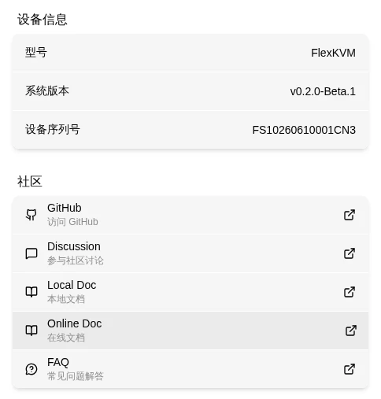

# 关于设备

查看 FlexKVM 的设备信息、固件版本和社区资源。

进入 FlexKVM 桌面的 **设置 → 关于** 标签页。

## 设备信息

显示当前设备的基本信息：

| 信息项 | 说明 |
|:-----|------|
| 型号 | 设备的具体型号，如 `FlexKVM` |
| 系统版本 | 当前运行的系统固件版本，如 `v0.1.2`。如需升级见[固件升级](../maintenance/upgrade/online.md) |
| 序列号 (SN) | 设备唯一序列号，联系技术支持时需提供 |

> 序列号可在设备包装盒或在 **FlexKVM 桌面 → 设置 → 关于** 页面中查看。

## 社区与联系

设备内 **设置 → 关于** 页面底部提供了以下快捷入口：

| 资源 | 说明 | 链接 |
|:----|------|:----:|
| GitHub | 开源仓库 | [github.com/chutuotek/flexkvm](https://github.com/chutuotek/flexkvm) |
| Discussion | 技术讨论与交流 | [github.com/chutuotek/flexkvm/discussions](https://github.com/chutuotek/flexkvm/discussions) |
| 本地文档 | 设备内置文档页面（无需联网），可在本页面底部打开 | 设备内路径 `/docs/` |
| 在线文档 | 最新在线文档 | [flexkvm.com/latest/](https://flexkvm.com/latest/) |
| 常见问题 | 使用中常见问题与排查 | [flexkvm.com/latest/support/](https://flexkvm.com/latest/support/) |

> 遇到问题时的排查顺序：先看[常见问题](../../support/index.md) 或在线文档，如仍未解决请联系技术支持并提供序列号。

---

[:octicons-arrow-left-24: 返回用户指南](../../index.md)
