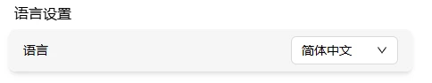
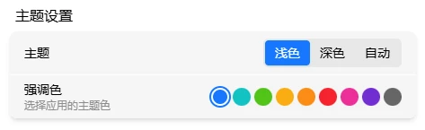

# 外观

调 FlexKVM 界面主题、语言和强调色。

进设置，找到对应设置区块。

## 语言

下拉切换：简体中文 / 英文。

## 主题

| 主题 | 说明 |
|------|------|
| 深色主题 | 深底浅字，适合暗光 |
| 浅色主题 | 浅底深字，适合亮光 |
| 自动（默认） | 跟系统自动切换 |

## 强调色

应用于按钮、链接、选中项等元素，默认蓝色。点颜色块切换：蓝、青、亮绿、橙黄、橙、红、品红、紫、灰。

---

[:octicons-arrow-left-24: 返回用户指南](../index.md)
