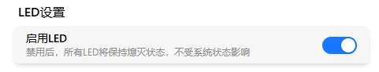

# 外观与显示

调整 FlexKVM 的界面外观和设备屏幕显示。

进入 FlexKVM 桌面的 **设置**，找到对应的设置区块。

---

## 语言

FlexKVM 支持以下语言，可通过下拉框切换：

- 简体中文
- 英文

---

## 主题

FlexKVM 支持三种主题模式：

| 主题 | 说明 |
|------|------|
| 深色主题 | 深色背景搭配浅色文字，降低视觉疲劳，适合暗光环境 |
| 浅色主题 | 浅色背景搭配深色文字，清晰明亮，适合亮光环境 |
| 自动（默认） | 根据系统设置自动切换深色和浅色主题 |

---

## 强调色

强调色应用于按钮、链接、选中项等元素，默认为蓝色。点击颜色块即可切换。

可选颜色：蓝色、青色、亮绿色、橙黄色、橙色、红色、品红色、紫色、灰色。

---

## OLED 屏幕

FlexKVM 设备本身带有一块 OLED 屏幕，用于显示设备状态信息（IP 地址、连接状态等）。

### 亮度

拖动滑块调节 OLED 屏幕亮度。

| 参数 | 说明 |
|:---:|------|
| 调节范围 | 1 ~ 10 档 |
| 生效方式 | 实时生效 |

亮度越高屏幕越清晰，但也越耗电。建议根据使用环境选择合适亮度。

### 休眠时间

OLED 屏幕在无操作后自动关闭的时间。到达设定时间后屏幕自动息屏，节省功耗并延长屏幕寿命。

| 参数 | 说明 |
|:---:|------|
| 可选值 | 10s / 30s / 60s / 120s / 300s / 600s |
| 生效方式 | 选择后即时生效 |

### 唤醒屏幕

屏幕息屏后，可以通过以下方式唤醒：

- **按设备按键**：按下 FlexKVM 设备上的物理按键，屏幕立即亮起
- **修改设置**：调整亮度或休眠时间后，屏幕自动唤醒

> 在配网模式或蓝牙配对模式下，屏幕不会自动息屏。

---

## LED 指示灯

控制 FlexKVM 设备上 LED 指示灯的开关。

| 参数 | 说明 |
|:----:|------|
| 默认值 | 开启 |
| 生效方式 | 即时生效 |

开启后，警告灯（红色）和状态灯（绿色）正常显示。关闭后所有指示灯熄灭，适合夜间或需要减少光污染的场合。
