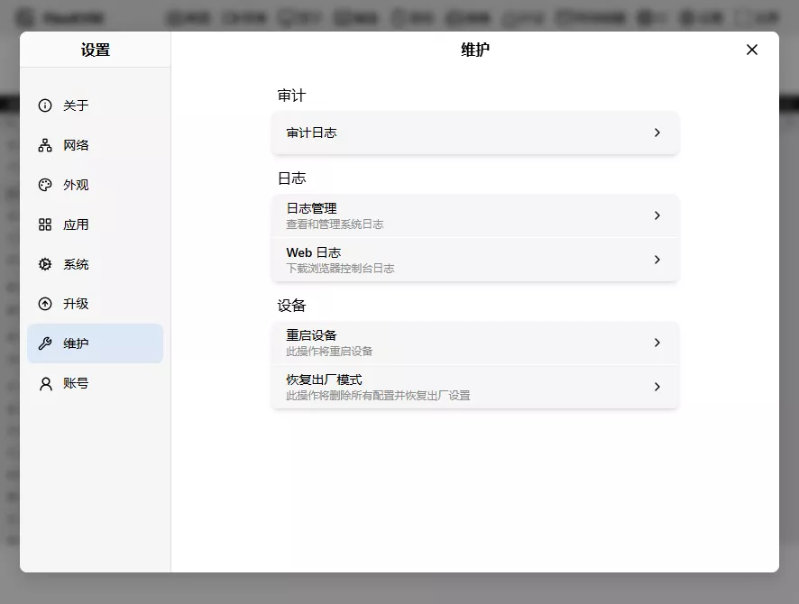
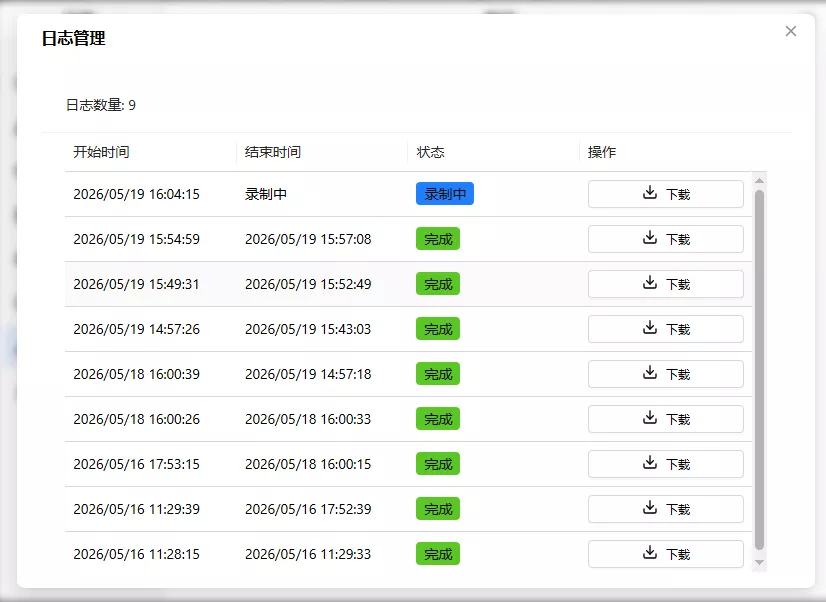
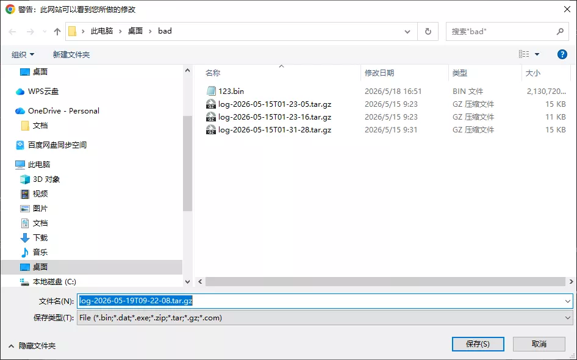
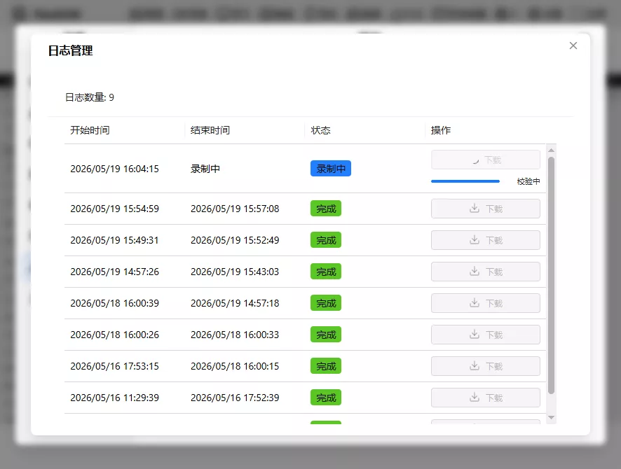

# 系统日志

> 系统日志主要用于设备厂商排查系统问题，日常使用无需关注，除非系统出现异常。

进入"设置" → "维护"：

系统日志在第二个组中，包含两个卡片：

- 日志管理
- WEB 日志

## 日志管理

点击"日志管理"卡片，弹出日志框：

日志框显示日志列表，每条日志包含开始时间、结束时间、状态和下载按钮。

- 最多保留 20 条日志记录，每次系统启动（重启、断电、软件崩溃等）产生一条新日志

状态分为三种：

- 录制中（蓝色）：正在录制日志
- 正常（绿色）：录制完成，无异常
- 异常（红色）：录制完成，系统出现崩溃

点击"下载"，选择保存目录：

下载按钮下方显示进度条：

进度条到达 100% 且校验通过后，文件保存到所选目录。如果校验失败，请重新下载。文件命名格式：`log-YYYY-MM-DDTHH-MM-SS.tar.gz`

- YYYY：年
- MM：月
- DD：日
- HH：时
- MM：分
- SS：秒

例如：`log-2026-05-19T09-22-08.tar.gz`

## WEB 日志

用于下载当前浏览器的日志，供设备厂商调试。

点击"WEB 日志"卡片，日志文件自动下载到浏览器下载目录，文件名为 `flexkvm-web-xxxxxxxxx.log`（`xxxxxxxxx` 为时间戳）。

---

[:octicons-arrow-left-24: 返回用户指南](../../index.md)
