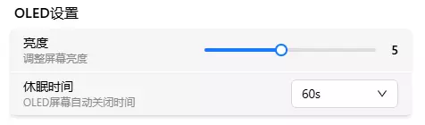

# OLED 屏幕

FlexKVM 设备带有一块 OLED 屏幕，用于显示设备状态信息（IP 地址、连接状态等）。

进入 FlexKVM 桌面的 **设置 → 系统**，找到 OLED 屏幕设置区块。

## 亮度

拖动滑块调节 OLED 屏幕亮度。

| 参数 | 说明 |
|:---:|------|
| 调节范围 | 1 ~ 10 档 |
| 生效方式 | 实时生效 |

亮度越高屏幕越清晰，但也越耗电。建议根据使用环境选择合适亮度。

## 休眠时间

OLED 屏幕在无操作后自动关闭的时间。到达设定时间后屏幕自动息屏，节省功耗并延长屏幕寿命。

| 参数 | 说明 |
|:---:|------|
| 可选值 | 10s / 30s / 60s / 120s / 300s / 600s |
| 生效方式 | 选择后即时生效 |

## 唤醒屏幕

屏幕息屏后，可以通过以下方式唤醒：

- **按设备按键**：按下 FlexKVM 设备上的物理按键，屏幕立即亮起
- **修改设置**：调整亮度或休眠时间后，屏幕自动唤醒

> 在配网模式或蓝牙配对模式下，屏幕不会自动息屏。

---

[:octicons-arrow-left-24: 返回用户指南](../../index.md)
