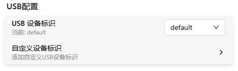
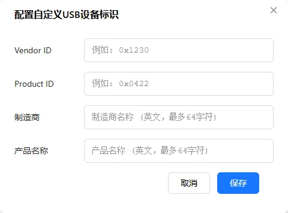

# USB 配置

FlexKVM 通过 USB 连接到被控主机，模拟键盘、鼠标和存储设备。USB 配置可以自定义设备标识信息（在被控主机的设备管理器中显示的名称和厂商）。

进入 **设置 → 系统**，找到 USB 配置区块。

## 切换设备标识

下拉列表显示系统内置的设备标识和自定义标识（如果有）。选择后 USB 连接会自动重启以应用新配置。

> 如果被控主机的 BIOS 或操作系统对特定 USB 设备有兼容性问题，可以尝试切换到其他预设标识。

## 自定义设备标识

点击"自定义设备标识"按钮，弹出配置窗口：

需要填写四个字段：

| 字段 | 格式 | 说明 |
|------|------|------|
| Vendor ID | 4 位十六进制（如 `0x046d`） | USB 厂商 ID |
| Product ID | 4 位十六进制（如 `0xc52b`） | USB 产品 ID |
| Manufacturer | 纯英文字符，最长 64 位 | 厂商名称 |
| Product | 纯英文字符，最长 64 位 | 产品名称 |

> 所有字段均为必填。Vendor ID 和 Product ID 必须以 `0x` 开头，后跟 4 位十六进制数字。

提交成功后，设备标识列表中出现 **custom** 选项，选择即可应用。

## USB 设备功能

FlexKVM 的 USB 连接包含以下功能模块：

| 功能 | 说明 |
|------|------|
| 键盘 | HID 键盘设备 |
| 鼠标（绝对模式） | HID 鼠标设备，绝对坐标 |
| 鼠标（相对模式） | HID 鼠标设备，相对坐标 |
| 音频 | UAC（USB Audio Class），用于音频输入输出 |
| 大容量存储 | USB Mass Storage，用于虚拟媒体挂载 |

> USB 设备标识的修改会影响所有上述功能模块。

---

[:octicons-arrow-left-24: 返回用户指南](../index.md)
