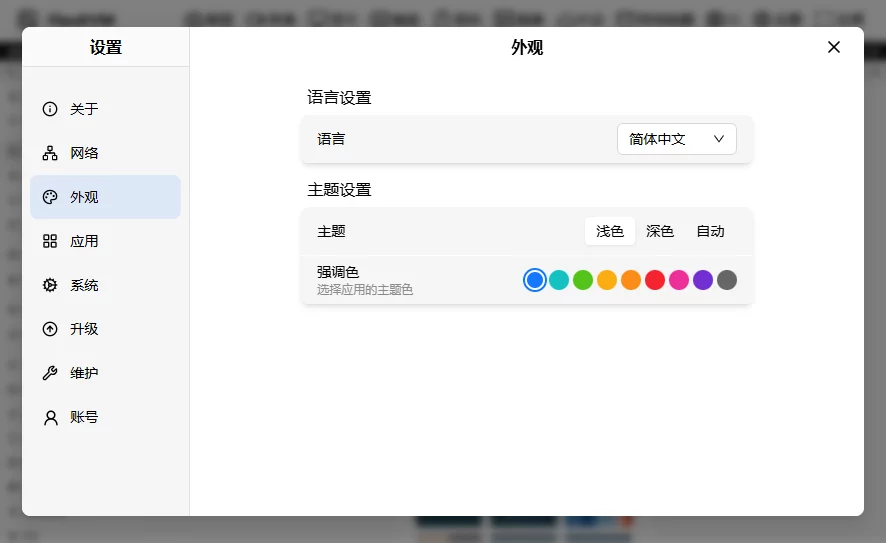

# 语言与主题

点击"设置”按钮，进入设置界面，选择"外观"选项卡，可以切换语言和主题。如下图所示：

可以看到界面中有两个区块，第二个区块就是主题设置，主题设置有两个卡片：

- 主题卡片：用于设置主题
- 强调色卡片：用于设置强调色

## 主题

FlexKVM 支持三种主题进行选择：

| 主题 | 说明 |
|------|------|
| 深色主题 | 深色背景搭配浅色文字，降低视觉疲劳，适合暗光环境 |
| 浅色主题 | 浅色背景搭配深色文字，清晰明亮，适合亮光环境 |
| 自动（默认） | 根据系统设置自动切换深色和浅色主题 |

**强调色**

强调色是用于按钮、链接、选中项等元素的颜色，可以通过点击列出的颜色进行选择，默认为蓝色。

有下面几种颜色可选：

- 蓝色（带有白色描边和内外两层轮廓）
- 青色（Cyan，介于蓝色和绿色之间的蓝绿色）
- 亮绿色（Lime Green）
- 橙黄色（Orange-Yellow，偏向黄色的橙色）
- 橙色（标准 Orange）
- 红色（Red）
- 品红色（Magenta，偏紫的洋红色）
- 紫色（Purple）
- 灰色（Gray
