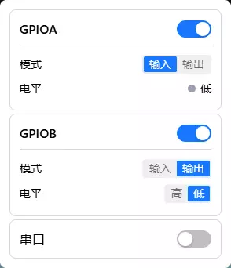
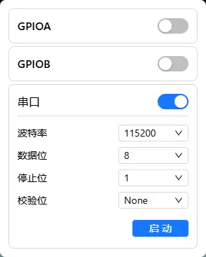

# IO

通过 GPIO 引脚连接和控制外部设备，以及通过 UART 串口与被控设备通信。

> 普通用户通常不需要使用此功能。它主要用于连接自定义硬件、调试嵌入式设备等专业场景。

## 菜单栏图标

| 图标                   | 含义                       |
| ------------------------ | ---------------------------- |
|  | IO 功能，GPIO 和 UART 串口 |

点击菜单栏的芯片图标打开IO 菜单。

包含两个功能模块：

- **GPIO 引脚控制**：GPIOA和GPIOB ,可以连接开关、传感器等外部硬件
- **UART 串口终端**：通过串口与被控设备通信

---

## GPIO 引脚控制

FlexKVM 提供 GPIOA 和 GPIOB 两个引脚，可独立配置。

### 启用与模式

每个引脚卡片上有一个开关，开启后可设置模式：

| 模式 | 用途         | 能做什么                   |
| ------ | -------------- | ---------------------------- |
| 输入 | 检测外部信号 | 显示当前是高电平还是低电平 |
| 输出 | 向外发送信号 | 手动切换高/低电平          |

### 输入模式

- 🟢 绿色灯 = 高电平
- ⚫ 灰色灯 = 低电平

电平由外部设备决定，不能手动切换。

### 输出模式

点击"高"或"低"按钮手动切换输出电平。

---

## UART 串口终端

通过串口与被控设备（如路由器、嵌入式开发板）进行命令行交互。

> 该串口是流式通信，与串口终端软件不同，不需要手动发送回车键。

### 配置参数

启用 UART 后，需要设置通信参数。**参数必须与被控设备完全一致**，否则会乱码或无法通信：

| 参数   | 默认值 | 选项                                      |
| -------- | -------- | ------------------------------------------- |
| 波特率 | 115200 | 常见值：9600、19200、38400、57600、115200 |
| 数据位 | 8      | 5 / 6 / 7 / 8                             |
| 停止位 | 1      | 1 / 2                                     |
| 校验位 | 无     | 无 / 奇校验 / 偶校验                      |

### 启动与断开

配置好参数后点击"启动"打开终端窗口，可直接与设备交互。

- 左上角显示当前的串口配置，当前配置：115200 8N1
- 波特率旁边有个亮点，绿色表示已连接，红色表示断开
- 右上角有三个按键，分别是: 导出，清空，断开

> 点击"断开"关闭连接。**连接期间不能修改参数**，如需修改请先断开。

## 常见问题

**串口终端显示乱码？**
→ 波特率、数据位等参数与被控设备不一致。核对设备参数后重新配置。

**GPIO 输出电压不对？**
→ 确认引脚已启用且模式为"输出"。
