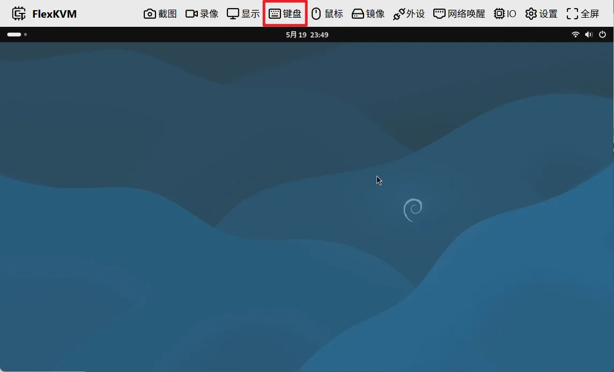
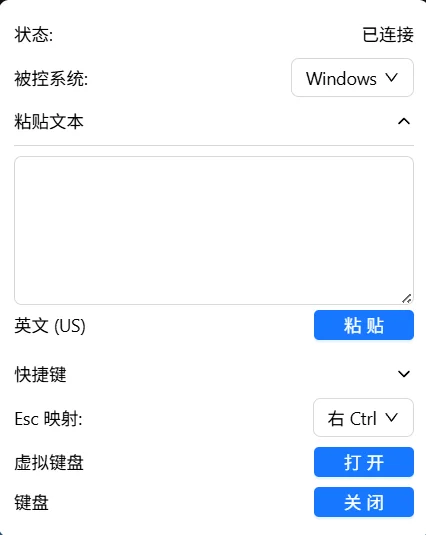
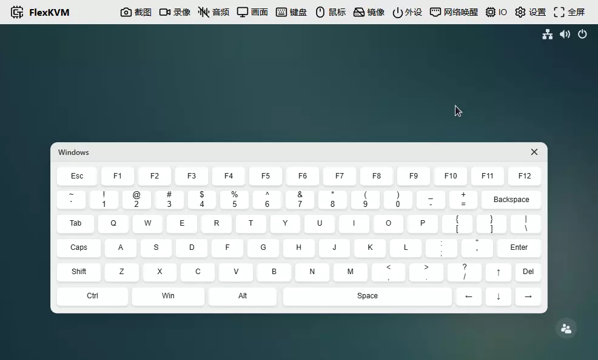

# 键盘

向被控主机输入文字、快捷键和组合键。

## 键盘按键

菜单栏中的键盘按键图标反映当前状态：

- **键盘图标**：键盘已连接，可以打字
- **键盘禁用图标**：键盘未连接或被关闭

## 键盘菜单

点击键盘按键弹出菜单：

### 状态

| 状态 | 说明 |
|------|------|
| 已连接 | 可以正常输入 |
| 未连接 | 键盘未连接到被控主机 |
| 未使能 | 已手动关闭，点击"开启"恢复 |

### 被控系统

告诉 FlexKVM 被控主机是什么系统，快捷键和虚拟键盘的布局会相应调整。

默认为 **Windows**，可选 Linux 或 MacOS。

### 粘贴文本

默认收起，点击展开。在输入框中粘贴或输入文字，点击"粘贴"发送到被控主机。

> 仅支持英文字符（字母、数字、符号），不支持中文。

- **跳过非英文字符**：开启后粘贴中文等内容时，自动过滤只保留英文部分。关闭则遇到非英文字符会提示错误。
- **添加到快速文本**：把当前文字保存起来方便以后一键发送（见下方快速文本）。

### 快速文本

默认收起，点击展开。把常用文字（密码、命令、模板等）保存起来，需要时一键发送，不用反复输入。

**添加**：点击 "+" 按钮，填写名称和文字内容：

| 字段 | 限制 |
|------|------|
| 名称 | 最长 32 个字符 |
| 文字内容 | 最长 4096 个字符 |

> 最多保存 10 条。

**使用**：每条快速文本可执行以下操作：

| 操作 | 说明 |
|------|------|
| 预览（眼睛图标） | 鼠标悬停查看完整内容 |
| 编辑（铅笔图标） | 修改名称或内容 |
| 发送（发送图标） | 一键发送到被控主机 |
| 取消（叉号图标） | 发送中途取消（仅发送时显示） |

**拖拽排序**：按住左侧拖拽手柄调整顺序。

**悬浮窗**：点击图钉按钮，快速文本会以悬浮窗形式显示，方便随时点击发送。

### 快捷键

默认收起，点击展开。常用快捷键一键发送，布局会跟随"被控系统"设置自动切换。

- **上方按钮**：
    - 齿轮图标：自定义快捷键（增删改）
    - 图钉图标：开启/关闭快捷键悬浮窗
- **下方按钮**：点击即可发送对应的快捷键

悬浮窗可以拖动，方便放在顺手的位置：

### 虚拟键盘

点击后在画面中弹出虚拟键盘，可以用鼠标点击按键输入：

**布局**：根据"被控系统"设置自动切换 Windows / Linux / macOS 布局。窗口较窄时自动换为紧凑布局。

**拖动**：按住标题栏可将键盘拖到任意位置。

虚拟键盘的工作方式和真实键盘一样——按下按键即生效，松开即释放：

**修饰键**（Ctrl、Alt、Shift、Win）——切换式，点一下按住，再点一下松开：

- 点击 → 按键变深色，相当于**按住**修饰键（立即生效）
- 再点 → 按键变浅色，相当于**松开**修饰键
- 可同时按住多个修饰键

例如：点击 **Ctrl**（深色，按住 Ctrl）→ 点击 **A** → 发送 **Ctrl+A** → 此时 Ctrl 仍然按住，可继续按其他键 → 再点 **Ctrl**（浅色，松开）。

**普通键**——按下时持续按住，松手时释放。长按就是持续按住该键。

> 关闭虚拟键盘或切换页面时，所有按键自动释放，不会出现按键卡住的情况。

### Esc 映射

在全屏模式或鼠标相对模式中，`Esc` 键被浏览器占用（用于退出模式），无法发送给被控主机。Esc 映射让你用另一个键代替 `Esc`。

默认映射：

| 你的系统 | 映射到 |
|----------|--------|
| Windows / Linux | Right Ctrl |
| macOS | Right Option |

也可手动选择：Right Ctrl、Right Option、Pause，或禁用此功能。

### 关闭与开启

- 状态为**已连接**或**未连接**时，点击"关闭"，状态变为**未使能**
- 状态为**未使能**时，点击"开启"，状态恢复

## 常见问题

**粘贴的文字没反应？**
→ 检查是否包含中文。粘贴文本仅支持英文字符。

**快捷键发送后没效果？**
→ 检查"被控系统"设置是否与被控主机一致。
