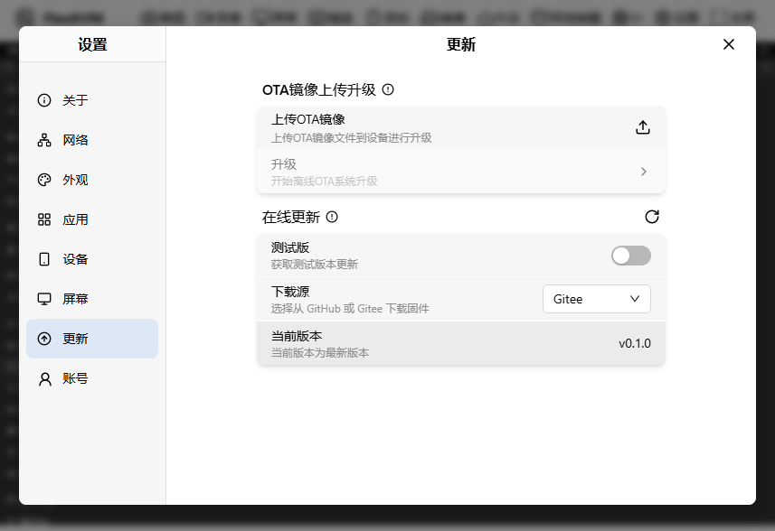
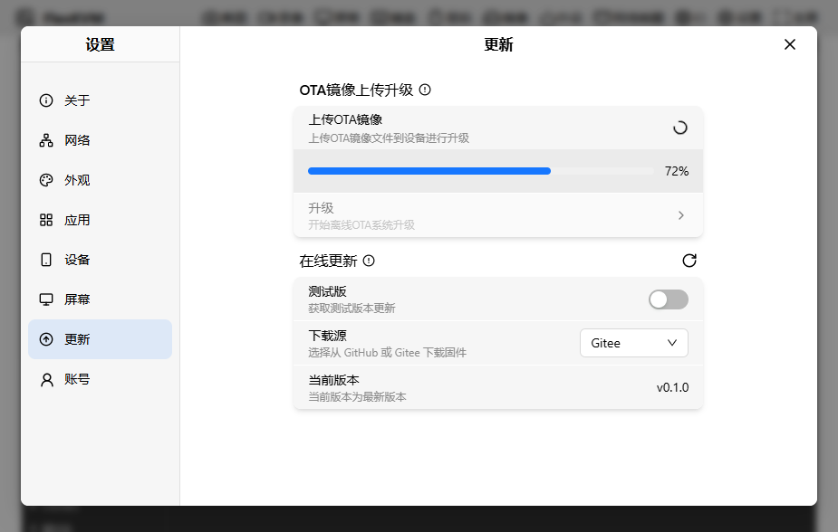
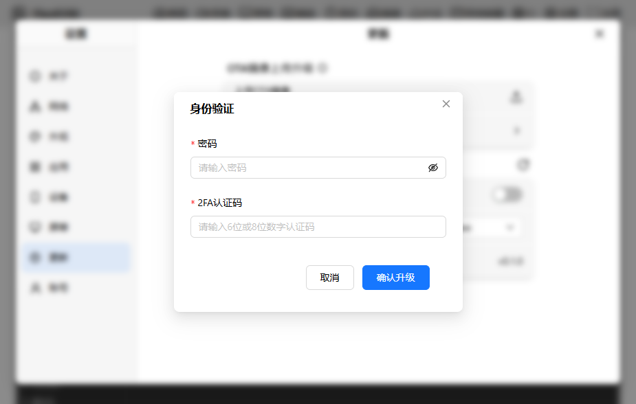

# 更新

点击"设置"按钮，进入设置界面，点击"更新"按钮，进入账号界面。如下图所示

可以看到有两个区块：

- OTA镜像上传升级
- 在线更新

## OTA镜像上传升级

可以看到有两个卡片：

- 上传镜像
- 升级

### 上传镜像

点击上传之后，需要选择OTA镜像文件，会打开文件选择器，然后就会将文件上传到服务器中，上传的时候上传镜像的卡片下面会有一个进度条，如下图所示

> ota镜像文件的命名为update_ota.tar,上传的时候需要注意文件名

上传成功之后，你会看到升级的卡片从灰色变亮

### 升级

点击升级之后，会弹出一个上传包验证框，如下图所示

上面有镜像文件的sha256sum值，需要用户进行验证，如果验证该固件没问题后，可以点击升级，然后会弹出一个用户验证框，如下图所示：

- 需要输入密码
- 如果开启了2FA之后需要输入2FA的验证码

点击之后就会显示当前更新的进度，如下图所示

> 注意：升级的时候请保持电源稳定，不要断电，否则会导致升级失败，更新完成后会自动重启
> 警告：ota升级时只能升级比当前版本更高的版本，不能降级和同级升级，否则会升级失败

## 在线更新

可以看到在线更新
