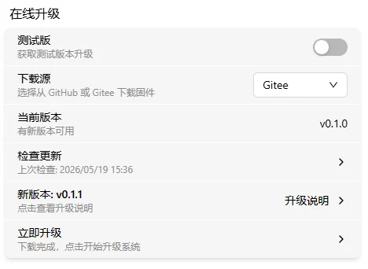

# 升级

点击"设置"按钮，进入设置界面，点击"升级"按钮，进入账号界面。如下图所示

可以看到第二个区块就是在线升级，一般来说在线升级会有四个卡片，如上图所示：

- 测试版选择
- 下载源选择
- 当前版本
- 检查更新

如果检查更新之后有新版本，会增加两个卡片，如下图所示：

- 测试版
- 下载源
- 当前版本
- 检查更新
- 新版本
- 下载安装包&立即升级

## 测试版

测试版是用来测试新版本的，一般会修复一些bug，或者增加一些新功能，但是可能不稳定。

> 注意: 测试版的固件不建议在生产环境中使用，更新的时候请注意。

## 下载源

下载源是用来选择下载固件地址的，目前有两个下载源：

- [Github](https://github.com/chutuotek/flexkvm/releases)
- [Gitee](https://gitee.com/chutuotek/flexkvm/releases)

> 注意：如果是中国境内用户，建议选择Gitee下载源，在国内下载速度会更快。

## 当前版本

当前版本会显示当前正在使用的固件版本号，如上图所示，当前版本是`v0.1.0`。

## 检查更新

点击"检查更新"按钮，会检查是否有新版本。

> 注意： 系统不会主动检查更新，需要手动点击"检查更新"按钮。
> 下载镜像前请检查是否已经是最新版本（如果是使用旧的缓存信息的话，会导致下载旧版本）

## 新版本

如果检查更新之后有新版本，会增加一个新版本卡片，显示新版本号，如上图所示，新版本是`v0.1.1`。

点击之后，会弹出一个模态框，显示新版本的更新日志，如下图所示：

如果网络不好会，新版日志会变成一个链接，点击链接可以打开浏览器查看新版本日志。

## 下载安装包&立即升级

如果没有下载安装包，点击"下载安装包"按钮，会进行下载操作，下面是下载进度条，如下图所示：

下载完成后，需要校验固件，检验成功后，会变成"立即升级"卡片，如下图所示：

点击"立即升级"按钮，需要验证用户信息，如下图所示：

输入密码，2FA码（如果开启了2FA的话），验证成功就会弹出一个框，显示当前升级，如下图所示：

升级成功后，会显示升级成功，如下图所示：

> 注意：升级的时候请保持电源稳定，不要断电，否则会导致升级失败，升级完成后会自动重启设备。

- 升级的过程中，会看到设备的屏幕会显示升级图标，且红色等会进行快速闪烁，如下图所示：
- 升级完成后，红灯会变红，然后重启设备
