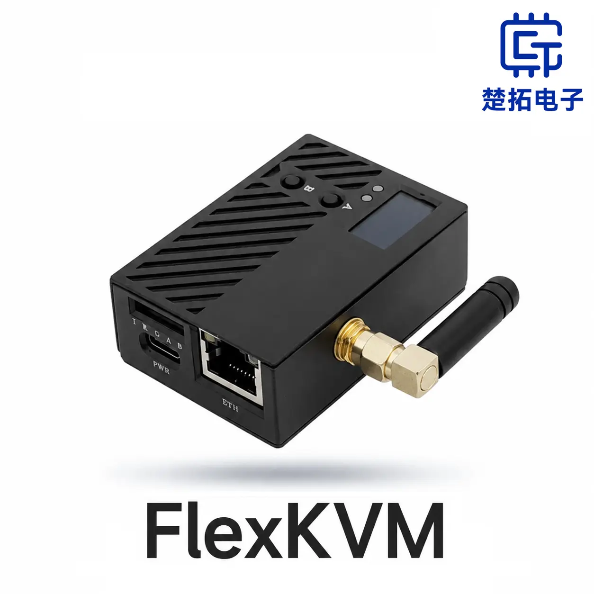
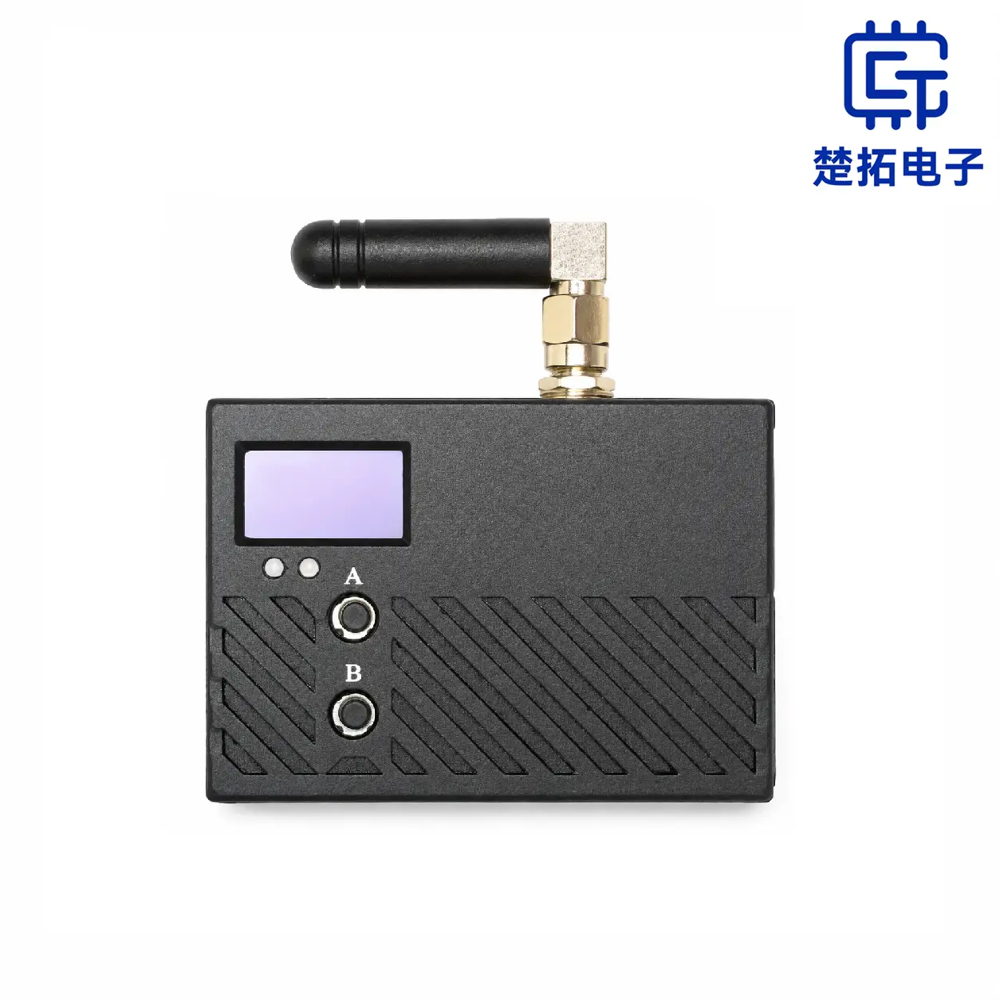
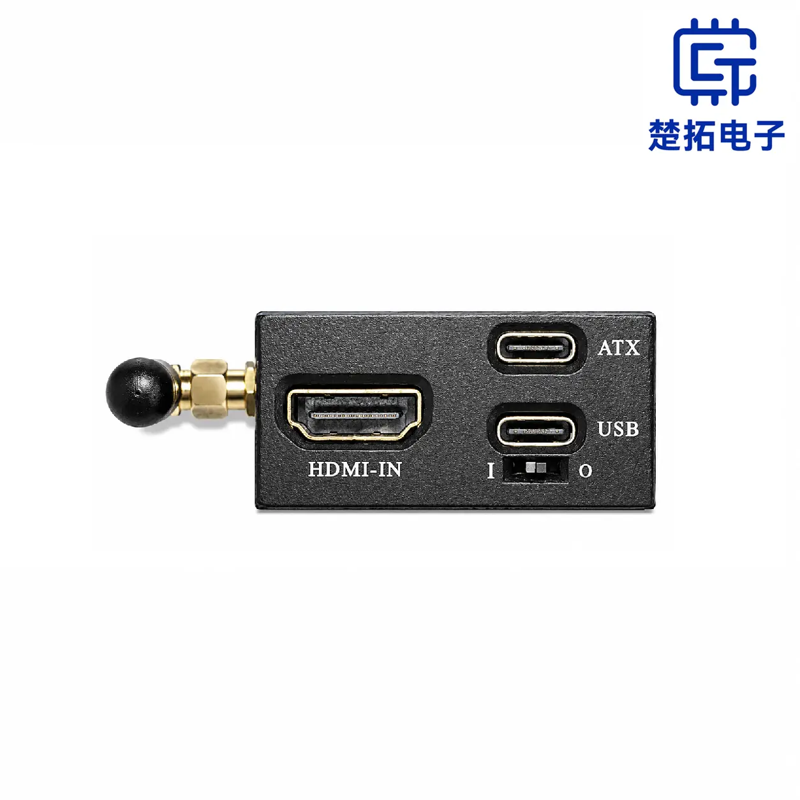
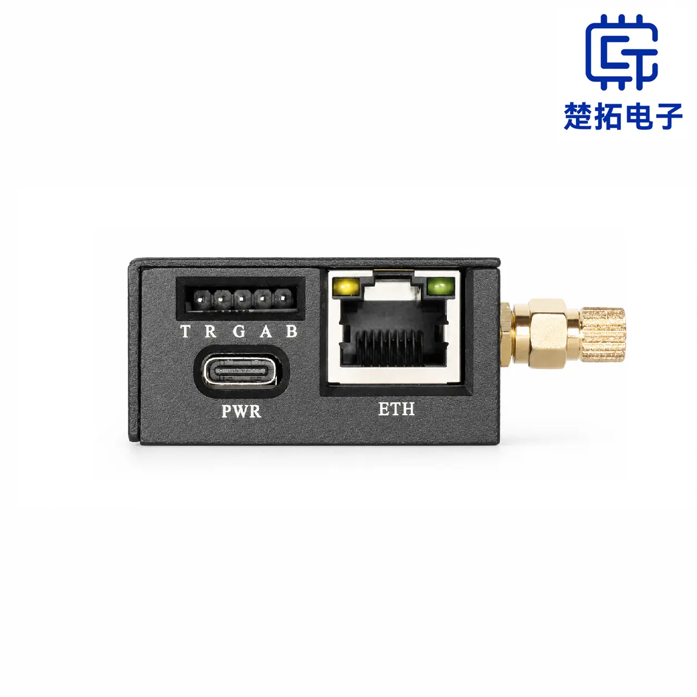
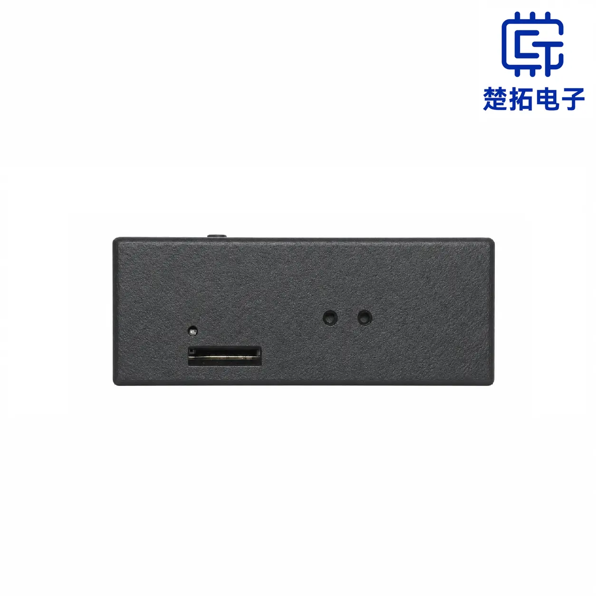
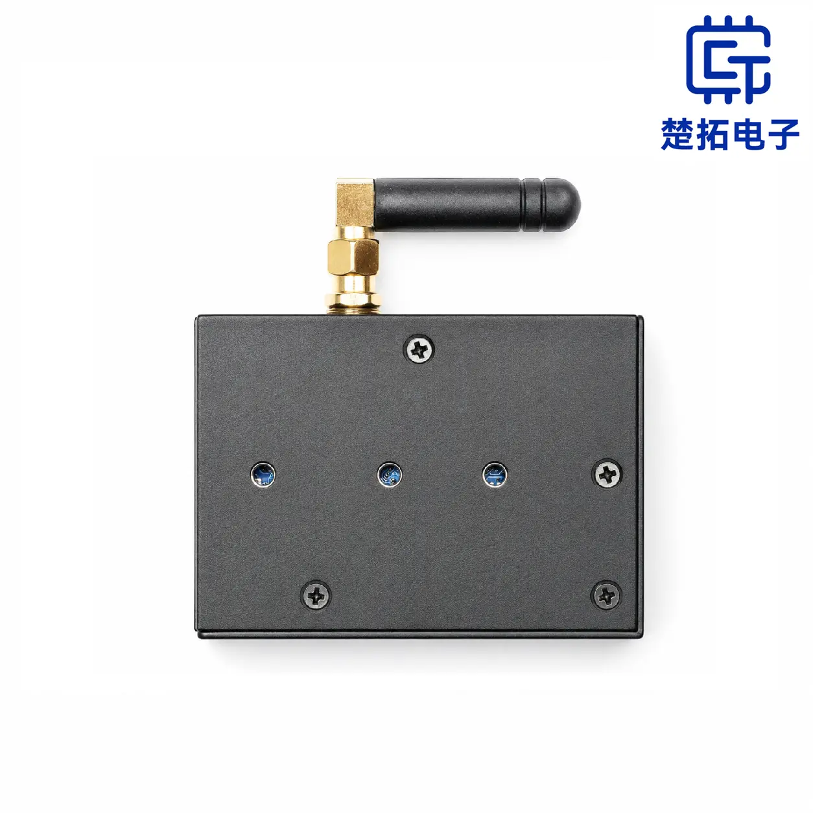
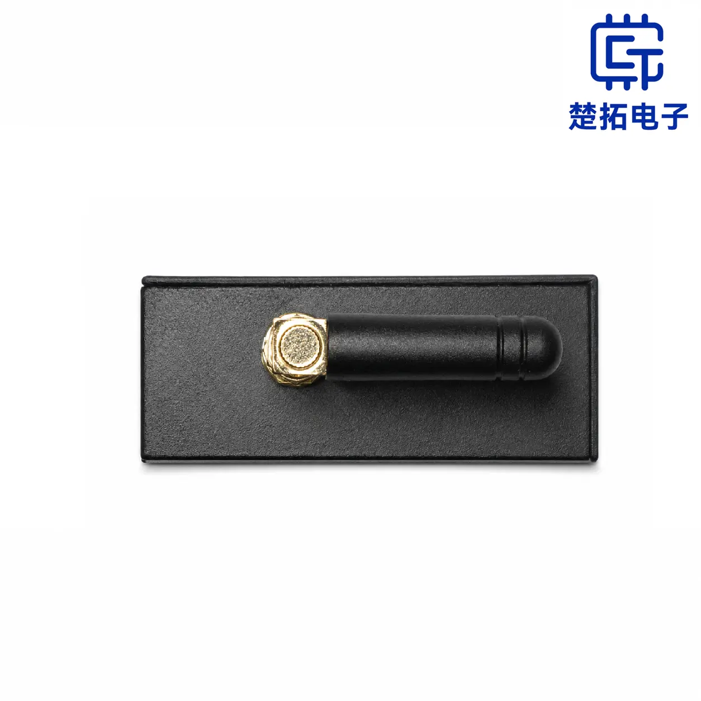

# FlexKVM

**Plug-and-play hardware-level out-of-band management.** Connect it to your target host's HDMI and USB ports, and you can view the screen, control keyboard and mouse, manage power, and mount ISOs — all from your browser or via Tailscale. Even if the target OS is crashed, has no graphics driver, or isn't even installed yet.

> No software to install on the target host. No public IP needed. As long as there's a network path, the server room is at your fingertips.

  

    
    
    
    
    
    
    
  

  <button class="carousel-btn carousel-prev" aria-label="Previous"><svg viewBox="0 0 24 24"><path d="M15.41 7.41L14 6l-6 6 6 6 1.41-1.41L10.83 12z"/></svg></button>
  <button class="carousel-btn carousel-next" aria-label="Next"><svg viewBox="0 0 24 24"><path d="M10 6L8.59 7.41 13.17 12l-4.58 4.59L10 18l6-6z"/></svg></button>
  

    
    
    
    
    
    
    
  

[Quick Start :octicons-rocket-24:](quick_start/index.md){ .md-button .md-button--primary }
[User Guide :material-book-open-page-variant:](guide/index.md){ .md-button }

---

## What It Solves

| Pain Point | FlexKVM's Solution |
|------------|-------------------|
| Server crashed, SSH/RDP down — have to haul a monitor to the server room | Hardware-level HDMI capture — see the screen remotely even when the OS is crashed |
| Headless device BIOS needs tweaking — always need to connect a monitor | Remote keyboard & mouse control all the way to BIOS/UEFI — operate as if you're sitting right there |
| Remote site system failure — sending someone on-site is expensive and slow | Built-in Tailscale mesh VPN — headquarters can remotely reinstall the OS |
| No network on-site — can't remotely access the device | Ethernet Direct (DHCP server) + WiFi 6 hotspot dual-channel — connect via phone or laptop, no router needed |

---

## Who Uses FlexKVM

- **:material-server: Enterprise IT / Data Centers**

    Server crashed? View blue screens, enter BIOS, remotely reinstall the OS from your office — no more emergency trips to the server room.

- **:material-home: Homelab & Enthusiasts**

    NAS, soft router, all-in-one without a monitor? No more hauling a TV over for boot issues. Remotely adjust boot order and reinstall any time.

- **:material-satellite-uplink: Edge Computing & IoT**

    Base station, unmanned server room, remote site failure — maintain from HQ via Tailscale. Downtime compressed from hours to minutes.

- **:material-robot: Embedded & Industrial Automation**

    Industrial PC, PLC locked in a cabinet — FlexKVM captures HDMI + UART serial dual-channel debugging. Quickly pinpoint production line faults.

---

## Key Features

- **:material-monitor-eye: Remote Desktop Control**

    Pure hardware HDMI capture, up to 1920x1200@60Hz. No dependency on OS, graphics drivers, or remote services — BIOS, blue screens, safe mode are all visible.

- **:material-headset: Bidirectional Audio**

    Emulates a USB audio device. Target host's system audio streams back to your browser; your microphone outputs to the target host.

- **:material-power: Remote Power Control**

    ATX control interface for remote power management — normal shutdown, force restart, force power-off.

- **:material-disc: Virtual Optical Drive**

    Use TF card as a virtual CD-ROM — supports bidirectional file transfer, remote OS installation, and more.

- **:material-vpn: Mesh VPN (Tailscale)**

    Built-in Tailscale client. No public IP, no port forwarding — end-to-end encrypted virtual network out of the box.

- **:material-wifi-arrow-left-right: Dual-Network Redundancy**

    Dual-band WiFi 6 + 100M Ethernet. Both links online simultaneously — if either fails, control is unaffected.

- **:material-lan-connect: Network-Free Control**

    No router? No problem. Ethernet Direct Mode (DHCP server) + WiFi 6 hotspot — two channels, zero infrastructure. OS installs, BIOS tweaks, troubleshooting — all without a network.

- **:material-fan-off: Low Power, Silent**

    Typical 1.5W–2.4W consumption. Fanless, 24/7 quiet operation.

- **:material-console-line: Serial & GPIO Expansion**

    UART serial communication and GPIO control for embedded debugging, industrial automation, and watchdog applications.

- **:material-magnet-on: Multi-Scene Deployment**

    Magnetic backplate / 35mm DIN rail clip / custom backplate — multiple mounting options for desktop, rack, and industrial environments.

- **:material-radiator: Aluminum Passive Cooling**

    Aluminum alloy chassis passive cooling — fanless, zero noise, no dust buildup, suitable for high-temperature environments.

- **:material-package-variant-closed: Ultra Compact**

    Just 65 × 46 × 22 mm, ~100g — take it anywhere.

---

## Core Specs

| Item | Spec |
|------|------|
| Dimensions | 65 × 46 × 22 mm (excl. antenna) |
| Weight | ~100g |
| Power | 5V / 1A (USB Type-C) |
| Typical power | 1.5W ~ 2.4W |
| Video input | HDMI 1.4, up to 1920×1200@60Hz |
| Audio | Bidirectional audio |
| Wireless | Dual-band WiFi 6 |
| Wired | RJ-45 100M Ethernet |
| External storage | Up to 512GB TF card |
| Expansion | 2× GPIO + 1× UART serial |
| Operating temp | 0°C ~ 70°C |

---

## Documentation

- **:material-rocket-launch: Quick Start**

    From wiring to remote control in 5 minutes, with illustrated step-by-step instructions.

    [:octicons-arrow-right-24: Get Started](quick_start/index.md)

- **:material-book-open-page-variant: User Guide**

    Complete feature documentation and configuration tutorials — browse by scenario or by function.

    [:octicons-arrow-right-24: Browse Guide](guide/index.md)

- **:material-chat-question: Help & Diagnostics**

    Quick FAQ answers + symptom-based troubleshooting.

    [:octicons-arrow-right-24: Get Help](support/index.md)

- **:material-account-group: Community & Contact**

    Feedback, join the community, contact us.

    [:octicons-arrow-right-24: Learn More](community/index.md)

---

## Purchase & Updates

- **:material-cart: Buy FlexKVM**

    Available from official channels.

    [:octicons-arrow-right-24: Buy Now](https://item.taobao.com/item.htm?id=1054030596204)

- **:material-text-box-multiple: Changelog**

    Version history and new features.

    [:octicons-arrow-right-24: Changelog](changelog/index.md)

> Need documentation for a different firmware version? Use the **version selector** in the top navigation bar.
