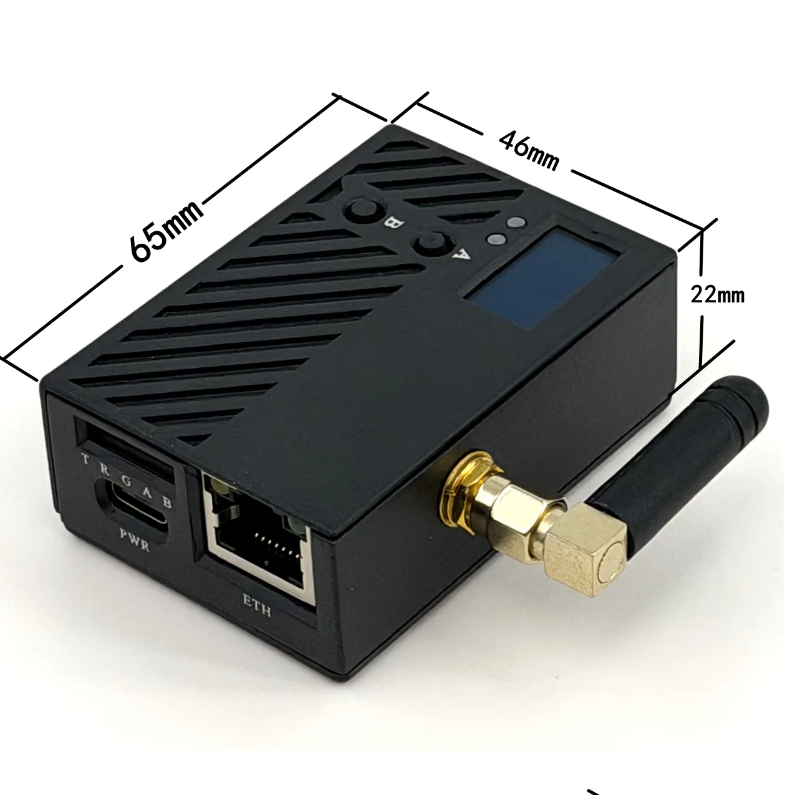

# FlexKVM

**即插即用的硬件级带外管理设备。** 将它接入目标主机的 HDMI 和 USB，你就能通过浏览器或 Tailscale 网络，随时随地查看屏幕、控制键鼠、开关电源、挂载 ISO —— 即使目标系统宕机、无显卡驱动、甚至未安装操作系统。

> 无需在被控主机上安装任何软件，无需公网 IP，只要网络可达，机房就在你手边。

  

    
    
  

  <button class="carousel-btn carousel-prev" aria-label="上一张"><svg viewBox="0 0 24 24"><path d="M15.41 7.41L14 6l-6 6 6 6 1.41-1.41L10.83 12z"/></svg></button>
  <button class="carousel-btn carousel-next" aria-label="下一张"><svg viewBox="0 0 24 24"><path d="M10 6L8.59 7.41 13.17 12l-4.58 4.59L10 18l6-6z"/></svg></button>
  

    
    
  

[快速入门 :octicons-rocket-24:](quick_start/index.md){ .md-button .md-button--primary }
[了解更多 :material-book-open-page-variant:](guide/index.md){ .md-button }

---

## 它解决什么问题

| 痛点 | FlexKVM 的方案 |
|------|---------------|
| 服务器宕机，SSH/RDP 连不上，只能搬显示器去机房 | 硬件级捕获 HDMI 信号，系统崩溃也能远程看屏幕 |
| 无头设备 BIOS 需要调整，每次都要接显示器 | 远程键鼠控制直达 BIOS/UEFI，像坐在本地一样操作 |
| 偏远站点系统故障，派人上门成本高、耗时长 | 内置 Tailscale 异地组网，总部直接远程重装系统 |

---

## 核心功能

- **:material-monitor-eye: 远程桌面控制**

    纯硬件捕获 HDMI 信号，最高 1920x1200@60Hz。不依赖操作系统、显卡驱动或远程服务 —— BIOS、蓝屏、安全模式都能看见。

- **:material-power: 远程开关机**

    ATX 控制接口实现电源远程管理，支持正常开关机、强制重启、强制断电。

- **:material-disc: 虚拟 U 盘**

    TF 卡上的 ISO 镜像远程挂载为虚拟光驱，实现无现场人员的系统安装与维护。

- **:material-vpn: 异地组网（Tailscale）**

    内置 Tailscale 客户端，无需公网 IP、无需端口转发，端到端加密的虚拟网络开箱即用。

- **:material-wifi-arrow-left-right: 双网络冗余**

    WiFi 6（2.4GHz/5GHz）+ 百兆有线，双网自动切换，保障连接不中断。

- **:material-fan-off: 低功耗静音**

    典型功耗 1.5W ~ 2.4W，铝合金被动散热，无风扇，7x24 小时安静运行。

---

## 谁在使用 FlexKVM

- **:material-server: 企业 IT / 数据中心**

    服务器宕机后在办公室就能查看蓝屏、进 BIOS、远程重装系统，省去工程师跑机房的麻烦。

- **:material-home: Homelab 与数码爱好者**

    NAS、软路由、All-in-One 不接显示器，出启动故障不再需要搬电视。随时远程调整启动项、重装系统。

- **:material-satellite-uplink: 边缘计算与 IoT**

    基站、无人机房、偏远站点故障，从总部通过 Tailscale 远程维护，停机从小时级压缩到分钟级。

- **:material-robot: 嵌入式与工业自动化**

    工控机、PLC 封闭在机柜里，FlexKVM 捕获 HDMI + UART 串口双通道调试，快速定位产线故障。

---

## 浏览文档

- **:material-rocket-launch: 快速入门**

    5 分钟从接线到远程控制，带图的完整流程。

    [:octicons-arrow-right-24: 开始使用](quick_start/index.md)

- **:material-book-open-page-variant: 用户指南**

    完整的功能说明和配置教程，按场景或按功能查阅。

    [:octicons-arrow-right-24: 查看指南](guide/index.md)

- **:material-chat-question: 常见问题与排查**

    FAQ 快速解答 + 按症状排查故障。

    [:octicons-arrow-right-24: 获取帮助](support/index.md)

- **:material-account-group: 社区与联系**

    反馈建议、加入社群、联系我们。

    [:octicons-arrow-right-24: 了解更多](community/index.md)

---

## 购买与更新

- **:material-cart: 购买 FlexKVM**

    前往官方淘宝店购买。

    [:octicons-arrow-right-24: 前往购买](https://item.taobao.com/item.htm?id=1054030596204)

- **:material-text-box-multiple: 更新日志**

    查看版本更新历史和新功能。

    [:octicons-arrow-right-24: 更新日志](changelog/index.md)

