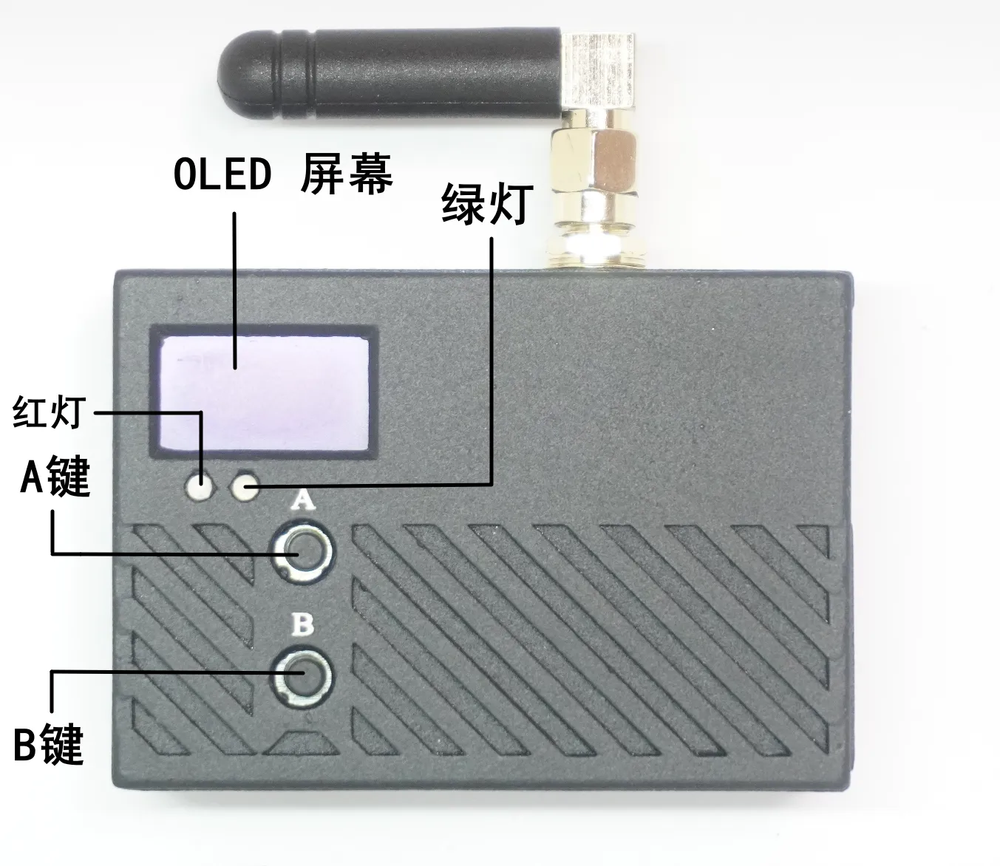
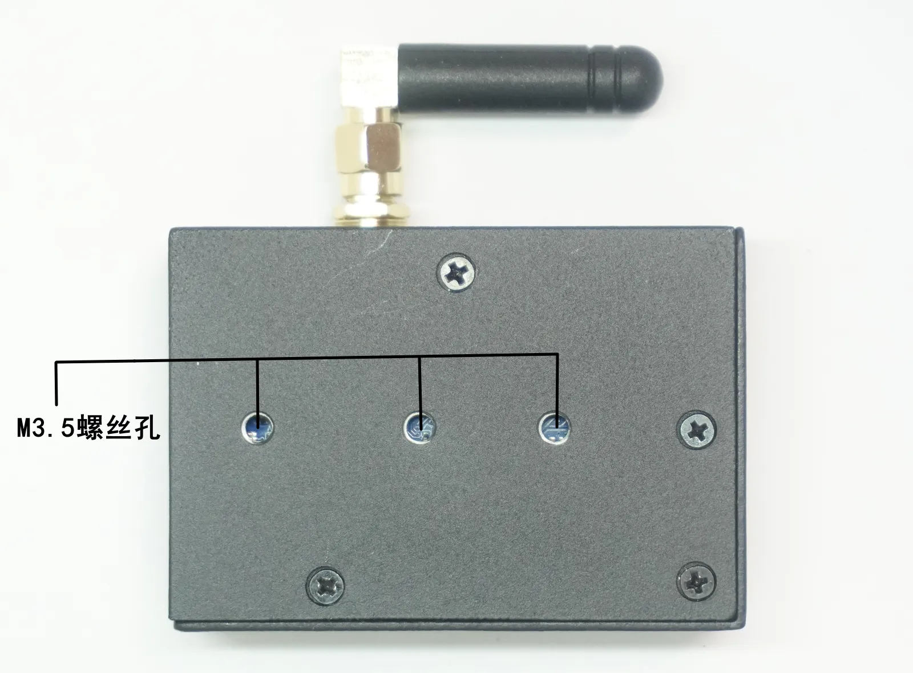
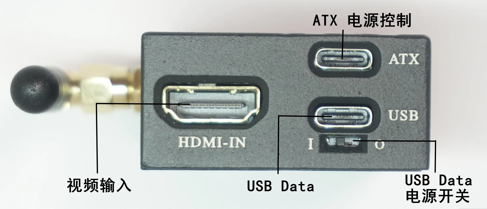
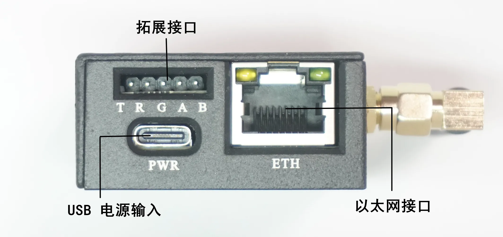
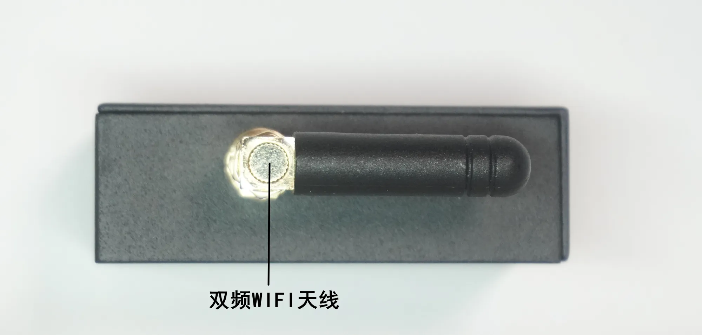
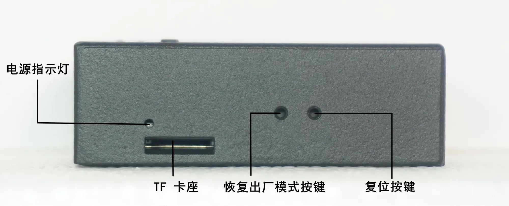

# FlexKVM

## 产品介绍

### 功能介绍

- 操作系统：深度定制 LINUX 5.10.160
- CPU：ARM Cortex-A7@1.6GHz
- 内存 (RAM)： 256MB DDR3L
- 存储 (ROM)： 256MB NAND Flash

### 物理与电气特性

- 电源输入：5V/1A
- 典型功耗： 1.5W ~ 2.4W（正常工作模式）
- 尺寸：65 x 46 x 22 mm
- 重量：约 100g

## 外观介绍

### 俯视图

#### oled显示屏

规格： 0.77 英寸 单色OLED 显示屏（128x64）

用来显示设备状态，ap配网信息等

如下图所示

#### 按键A/B

**按键 A（配网键）：**

- 长按 3 秒 - 6秒之间：显示AP热点图标，释放按键后进入热点配网模式
- 长按 6 秒：返回主界面

**按键 B（模式切换键）：**

- 长按 3 秒：WiFi 模式与 AP 模式切换

#### 状态指示灯

**绿灯** ：

- 灭：待机状态，视频信号未锁定
- 常亮：视频信号锁定，正常
- 慢闪：被远程操控中
- 快闪：数据传输中

**红灯** ：

- 灭：待机状态，无错误
- 常亮：系统错误，请检查设备，程序退出，内核pannic
- 慢闪：视频信号丢失
- 快闪：固件升级中

### 仰视图

#### 螺丝孔

使用M3.5螺丝固定设备

### 主视图

#### HDMI IN

标准HDMI接口，支持最高1920x1200@60fps输入

#### USB Data

USB Type-C DATA（USB2.0 数据通信/OTG）

#### USB Data电源控制开关

用来控制USB Data的电源输入开关，如果拨到O，则为支持电源输入，可以使用usb data输入电源给整个设备供电，如下图所示

#### ATX 控制接口

USB Type-C ATX（电脑电源控制接口，需要带数据通道的数据线进行连接）

### 后视图

#### 100M 以太网口

10/100M 自适应以太网

#### usb power接口

输入需要是5V/1A及以上

#### uart接口

2.54mm 排针 3.3V电平，T为TXD, R为RXD,GND为地

接线如下：

| flexkvm  | 其他设备   |
| -------- | ------ |
| GND      | GND    |
| TXD      | RXD    |
| RXD      | TXD    |

#### gpio接口

2.54mm 排针 3.3V电平

注意：请勿连接5V电平信号，否则会烧坏设备

### 左视图

#### 天线接口

使用的是双频天线支持2.4GHz 和 5GHz，sma接口带针

### 右视图

#### tf卡槽

支持最高512GB的tf卡，使用的是micro sd卡接口

#### 电源指示灯

电源指示灯，红点常亮表示设备已接通电源

#### 恢复出厂模式按键

长按15s，恢复设备到出厂设置

#### 复位按键

短按，强制系统重启

---

### 尺寸图

#### 带机柜夹尺寸图

#### 带磁吸背板尺寸图
