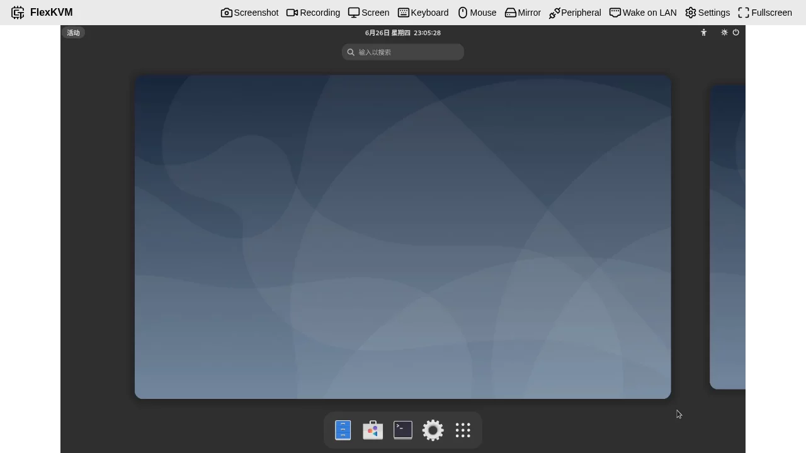

# Quick Start

Welcome to FlexKVM! This guide will help you get started with FlexKVM remote device management in 10 minutes.

---

## 1. Package Contents

Please check that the following items are included in the package:

| Item | Quantity | Description |
|------|----------|-------------|
| FlexKVM Main Unit | 1 | Core device |
| HDMI Cable | 1 | Connect to controlled device's video output |
| USB Type-C Data Cable | 2 | Power + Data transfer |
| ATX Controller | 1 | Remote power control for PC |
| Magnetic Backplate | 1 | Mount inside computer case |
| Rack Mount Bracket | 1 | Mount to server rack |

**Optional Accessories:**

- POE Splitter (Power over Ethernet)
- TF Memory Card (for offline upgrades)

---

## 2. Hardware Interface

### 2.1 Interface Description

| Interface | Location | Function |
|-----------|----------|----------|
| HDMI IN | Top | Connect to controlled device's HDMI output |
| USB Data | Side | Connect to controlled device's USB port (keyboard/mouse control) |
| USB Power | Side | Device power supply (5V/1A) |
| ATX Port | Side | Connect ATX controller |
| Ethernet Port | Side | 100Mbps wired network |
| TF Card Slot | Side | Storage expansion / offline upgrade |
| OLED Screen | Front | Display device status |
| Button A/B | Front | Function buttons |

### 2.2 LED Indicators

| LED | Color | Status Description |
|-----|-------|-------------------|
| Power LED | Green | Device powered on |
| Status LED | Green/Red | Green=Normal operation, Red=Network configuration mode |

### 2.3 Button Functions

**Button A (Network Configuration):**

- Long press 3 seconds: Enter AP network configuration mode
- Long press 9 seconds: Return to main interface

**Button B (Mode Switch):**

- Long press 3 seconds: Toggle between WiFi mode and AP mode

---

## 3. Device Connection

### 3.1 Basic Connection

```
┌─────────────┐     HDMI Cable     ┌──────────┐
│  Controlled │ ◄───────────────── │ FlexKVM  │
│   Computer  │                    │  Main    │
│  (Server)   │                    │  Unit    │
└─────────────┘                    └────┬─────┘
      ▲                                 │
      │ USB Data Cable                  │ USB Power Cable
      └─────────────────────────────────┘
```

1. **Video Connection**: Connect HDMI cable from controlled computer's HDMI output to FlexKVM's HDMI IN port
2. **Control Connection**: Connect USB Data cable between controlled computer's USB port and FlexKVM's USB Data port
3. **Power Connection**: Connect USB Power cable to power adapter (5V/1A)

### 3.2 ATX Controller Connection (Optional)

For remote power control:

1. Open the controlled computer case
2. Locate ATX power switch pins on motherboard (usually labeled POWER SW, RESET SW, etc.)
3. Connect ATX controller to corresponding pins
4. Connect ATX controller's USB end to FlexKVM's ATX port

---

## 4. Network Configuration

### 4.1 Network Mode Selection

| Method | Scenario | Difficulty |
|--------|----------|------------|
| Wired Network | Have Ethernet cable | ⭐ Easiest |
| WiFi Configuration | Wireless network available | ⭐⭐ Easy |
| AP Mode | No existing network | ⭐⭐⭐ Medium |

### 4.2 Wired Network (Recommended)

Simply plug the Ethernet cable into FlexKVM. The device will automatically obtain IP address via DHCP.

**Check IP Address:**

- View OLED screen display
- Or check device list in router management page

### 4.3 WiFi Configuration

1. Ensure device is in normal mode (not AP mode)
2. Connect phone or computer to FlexKVM hotspot (SSID starts with FlexKVM)
3. Visit `192.168.4.1` in browser
4. Select WiFi network and enter password
5. Save configuration and wait for device reboot

### 4.4 AP Mode (Button A)

1. Long press Button A for 3 seconds until AP icon appears on screen
2. Release button to enter AP configuration mode
3. Connect phone/computer to FlexKVM hotspot
4. Visit `192.168.4.1` to configure network

---

## 5. First Login and Account Creation

### 5.1 Access Web Interface

1. Open browser (Chrome/Edge/Firefox recommended)
2. Visit device IP address: `https://device-ip`

> **Note**: Since using self-signed certificate, browser will warn "Not secure", click "Advanced" → "Proceed"


### 5.2 Create Administrator Account

On first login, the system will prompt to create an administrator account:

| Field | Requirements |
|-------|-------------|
| Username | 4-32 characters, letters/numbers/underscore/dot/hyphen |
| Password | 8-32 characters, printable characters, no spaces |

Click "Create Account" to enter the main interface.

### 5.3 Subsequent Logins

After account creation, login requires:

- Username
- Password
- 2FA verification code (if enabled)

---

## 6. Main Interface



### 6.1 Video Area

The center displays real-time video of controlled device, supporting:

- Mouse control (Absolute/Relative mode)
- Keyboard input
- Full screen view

### 6.2 Top Menu Bar

| Icon | Function | Description |
|------|----------|-------------|
| 📷 Screenshot | Screenshot | Save current frame as image |
| 🎥 Recording | Recording | Record video to TF card |
| 🖥️ Screen | Screen Settings | Resolution/Quality/Effect adjustment |
| ⌨️ Keyboard | Keyboard Settings | Virtual keyboard / Paste text |
| 🖱️ Mouse | Mouse Settings | Mode switch / Sensitivity adjustment |
| 🔄 Mirror | Mirror Mode | Toggle mirror display |
| ⚡ Peripheral | ATX Control | Remote power on/off/reset |
| 🌐 Wake on LAN | WOL | Wake on LAN configuration |
| ⚙️ Settings | System Settings | Comprehensive configuration options |
| ⛶ Fullscreen | Fullscreen | Enter fullscreen mode |

---

## 7. Basic Operations

### 7.1 Mouse Control

**Absolute Mode** (Default):

- Mouse position 1:1 maps to controlled device screen
- Suitable for precise operations

**Relative Mode**:

- Need to click on video to capture mouse focus
- Suitable for gaming scenarios

Switch: Click "🖱️ Mouse" in menu bar to select mode

### 7.2 Keyboard Input

- Direct key input
- Support combination keys (Ctrl+C, Alt+Tab, etc.)
- Virtual keyboard: Click "⌨️ Keyboard" to open

### 7.3 Remote Power Control (Requires ATX)

Click "⚡ Peripheral" menu:

- **Power Button**: Short press/Long press to power on/off
- **Reset Button**: Restart controlled device

---

## 8. Quick Troubleshooting

| Issue | Solution |
|-------|----------|
| Cannot access Web interface | Check device IP address, confirm network connection |
| Black screen | Check HDMI connection, confirm controlled device has video output |
| Mouse not working | Check USB Data cable, try switching mouse mode |
| Forgot password | Long press factory reset button to restore defaults |
| OLED display abnormal | Restart device, check power supply stability |

---

## 9. Next Steps

After basic setup, you can:

- Read [Product Introduction](../product/index.md) for detailed hardware information
- Read [User Guide](../guide/index.md) for all features
- Check [FAQ](../support/faq/index.md) for common questions

!!! question "Need help?"
    If you encounter issues during setup, please check [Troubleshooting](../support/troubleshooting/index.md) for help.

---

**Technical Support**

- GitHub: https://github.com/kalous12/FlexKVM
- Community: https://github.com/kalous12/FlexKVM/discussions
