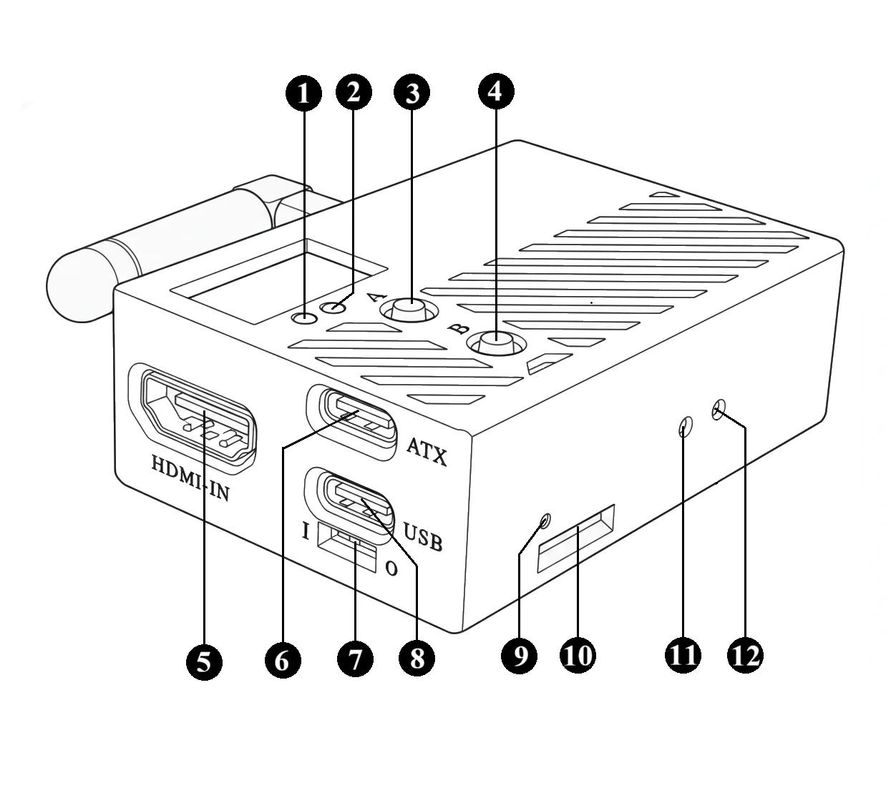
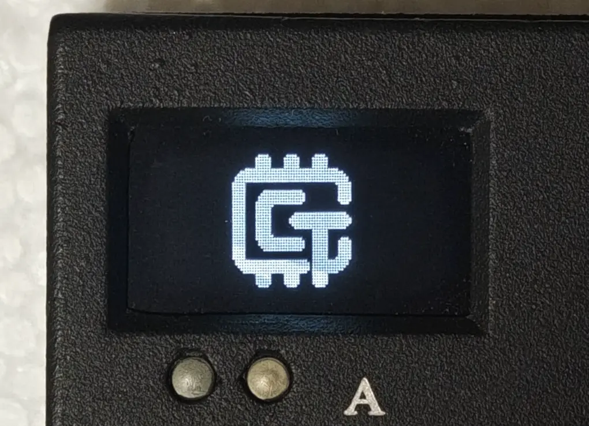
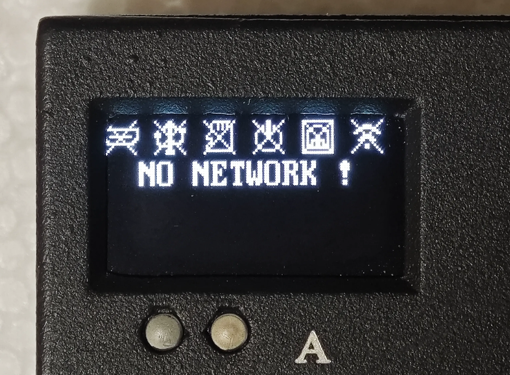
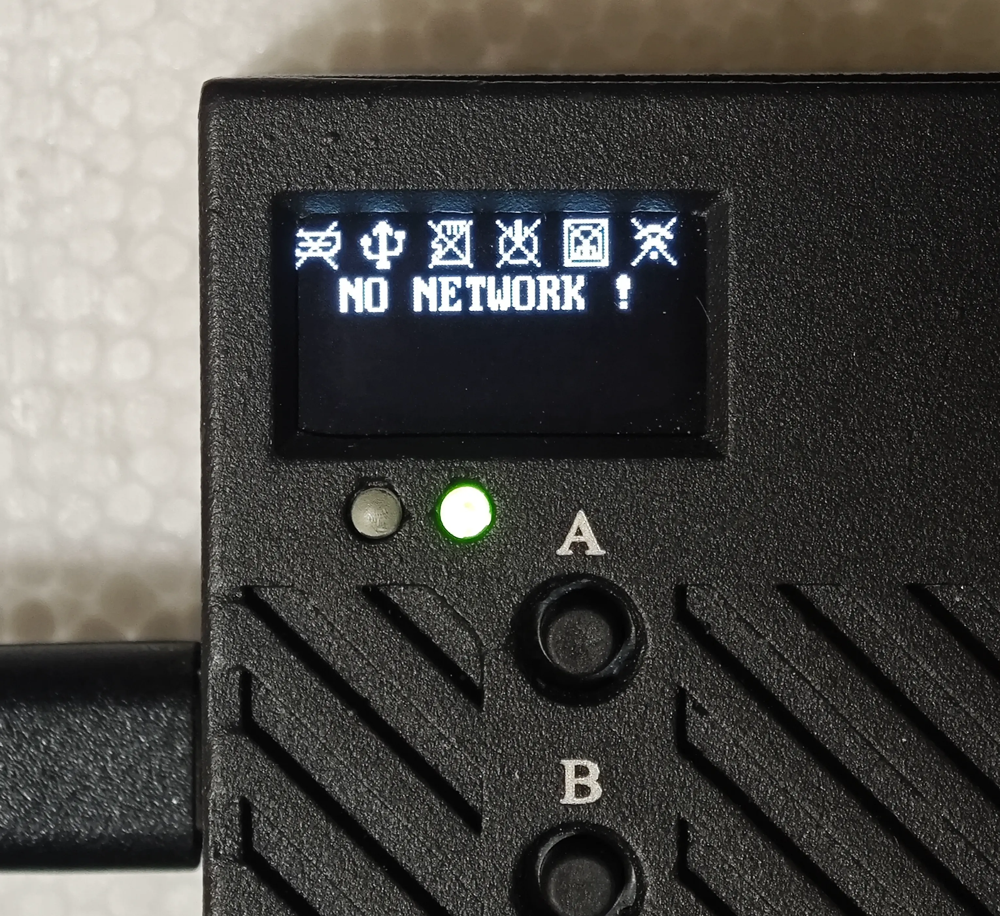
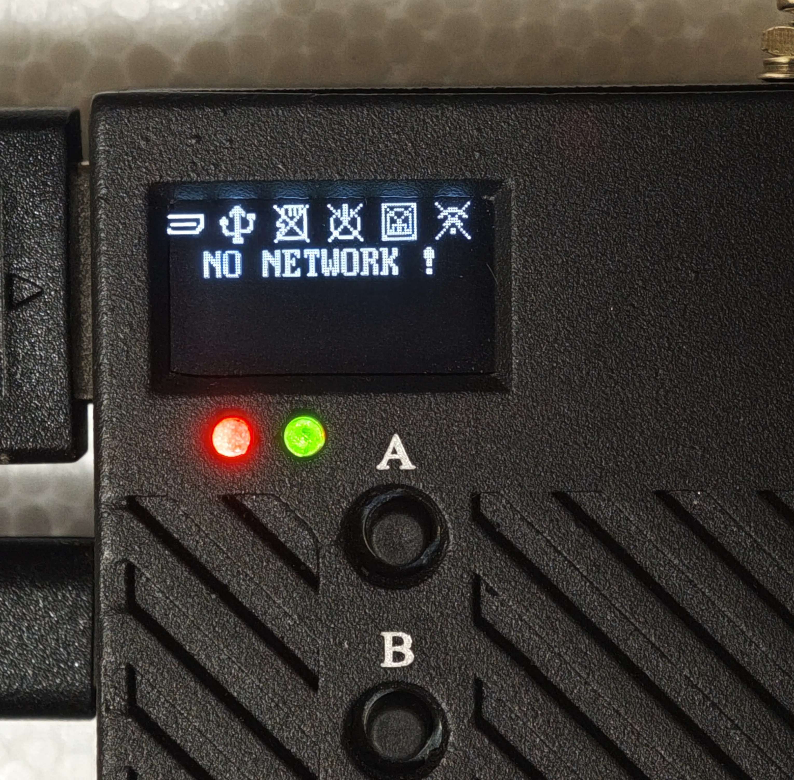
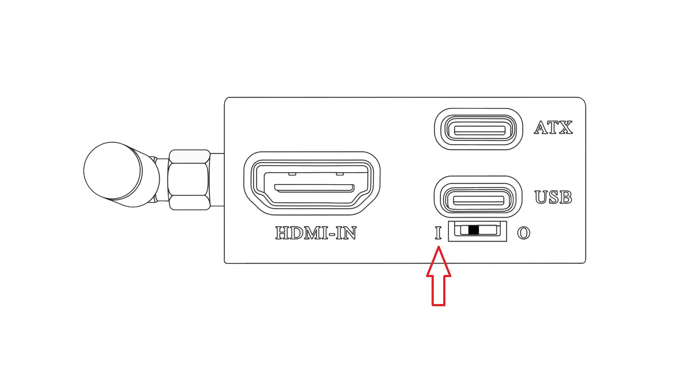
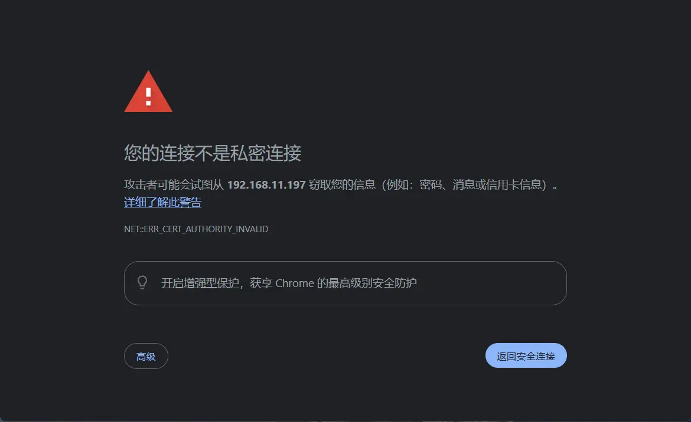
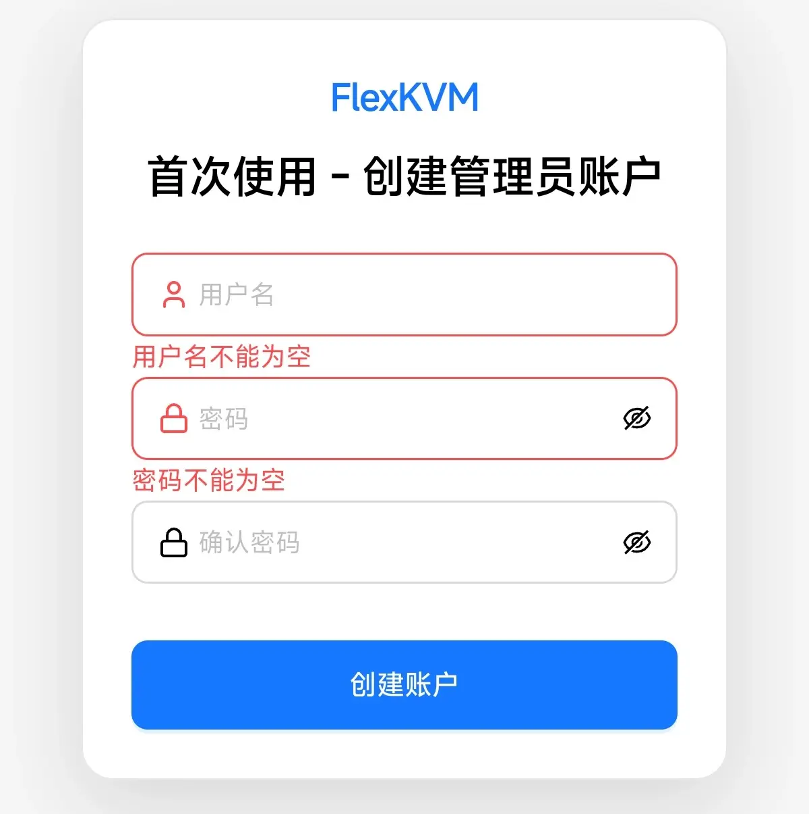

# 快速开始

欢迎使用 FlexKVM！FlexKVM 是一款远程设备管理工具，通过 USB 和 HDMI 连接您的电脑（以下称为**被控设备**），让您通过网络在浏览器中远程操控它。

## 术语解释

| 术语 | 解释 |
|------|------|
| FlexKVM | FlexKVM设备 的简称，本文档中统一使用该简称 |
| 被控设备 | 需要远程管理的设备，如电脑、服务器等 |
| 控制端 | 操控 FlexKVM 的设备，如电脑、手机等 |

## 流程概览

快速上手的三个步骤：

> **开始前**：请先确认[包装清单](#包装清单)物品齐全，准备好[自备物品](#准备工作)，并[了解接口位置](#接口速览)。

| 步骤 | 操作 | 完成标志 |
|------|------|----------|
| 1. 接线启动 | 连接电源、USB、HDMI | OLED 显示设备状态界面，状态指示灯常亮 |
| 2. 网络配置 | 连接有线网络或配置 WiFi | OLED 显示设备 IP 地址 |
| 3. 访问设备 | 浏览器打开设备 IP，创建账户 | 浏览器显示 FlexKVM 主界面 |

> 整个流程大约需要 3-5 分钟。

---

## 包装清单

打开包装后，请对照下表核对物品是否齐全：

| 编号 | 物品 | 数量 | 说明 |
|------|------|------|------|
| [1] | FlexKVM 主机 | 1 台 | 核心设备 |
| [2] | HDMI 连接线 | 1 条 | 连接被控设备视频输出 |
| [3] | USB Type-C 数据线 | 3 条 | 供电、数据传输与 ATX 控制，三条规格相同可互换 |
| [4] | ATX 控制器 | 1 个 | 远程控制电脑电源开关 |
| [5] | ATX 杜邦线 | 1 组 | ATX 控制器接线 |
| [6] | 磁吸背板 | 1 个 | 将设备固定在机柜上 |
| [7] | 说明书 | 1 份 | 产品使用说明 |

> 磁吸背板已预装在主机背面，开箱时确认即可。
>
> ATX 控制器和杜邦线用于远程开关机功能，快速上手阶段无需安装，后续可参考 [ATX 控制](../guide/toolbar/atx.md) 进行配置。

---

## 准备工作

除包装内的物品外，您还需要自备：

| 物品 | 用途 | 备注 |
|------|------|------|
| USB 电源适配器(5V/1A及以上) | 独立供电 | **推荐**，稳定性最佳 |
| 网线 | 有线联网 | 使用热点配网则不需要 |
| 被控设备（电脑/服务器） | 被远程管理的目标设备 | 需具备 HDMI 输出和 USB 接口 |
| 可上网的电脑或手机 | 配置设备、远程访问 | 推荐 Chrome / Edge / Firefox 浏览器 |

> 没有 USB 电源适配器？您可以使用被控设备的 USB 端口供电，但被控设备关机后 FlexKVM 也会断电，无法远程开关机。
>
> 浏览器推荐使用 Chrome / Edge / Firefox，其他浏览器可能存在兼容性问题(比如说画面显示异常)。
>
> FlexKVM 和控制端（电脑/手机）需要处于**同一个局域网**（连接同一个路由器），否则无法通信。请在开始前确认您的网络环境。

---

## 接口速览

以下是快速上手过程中会用到的接口，了解它们的位置和用途即可。

| 编号 | 名称 | 说明 |
|:----:|------|------|
| [1] | 警告指示灯（红色） | 反映网络和系统状态，详见下方速查表 |
| [2] | 状态指示灯（绿色） | 反映设备连接状态，判断设备是否正常工作的首要依据 |
| [3] | 按键 A | 长按 3~6 秒进入热点配网，超过 6 秒返回主界面 |
| [5] | HDMI 输入 | 连接被控设备的 HDMI 输出 |
| [7] | USB 供电开关 | 控制 USB 接口是否从被控设备取电 |
| [8] | USB 接口 | 连接被控设备，传输键鼠信号 |
| [9] | 电源指示灯（红色） | 亮 = 已供电，灭 = 未供电 |

| 编号 | 名称 | 说明 |
|:----:|------|------|
| [14] | OLED 显示屏 | 显示设备状态、IP 地址、配网信息 |
| [15] | 电源接口 | 连接 5V 电源适配器 |
| [16] | 百兆网口 | 连接路由器或交换机 |
| [17] | WiFi 天线接口 | 天线出厂已安装，无需用户操作 |

> 其他接口（按键 B、ATX 控制、TF 卡槽、恢复出厂、复位、拓展接口等）请参考 [接口介绍](../guide/hardware/interface.md)。

### 状态指示灯速查表

| 状态 | 频率 | 含义 |
|------|------|------|
| 快闪 | 约 5 次/秒 | **USB 未连接** 或 **被控设备关机** |
| 慢闪 | 约 1 次/秒 | **HDMI 未连接** 或 **被控设备休眠** |
| 常亮 | — | 全部连接正常 |
| 常灭 | — | 系统未正常启动 |

> 优先级：快闪 > 慢闪 > 常亮。例如 USB 和 HDMI 都未连接时显示快闪；USB 正常但 HDMI 未连接时显示慢闪。
>
> 在连接过程中，请确保被控设备处于正常工作状态，被控设备关机或休眠可能会导致后面的步骤无法正常进行。

### 警告指示灯速查表

警告指示灯（[1]，红色）反映设备的网络和系统状态:

| 状态 | 频率 | 含义 | 您该怎么做 |
|------|------|------|-----------|
| 常灭 | — | 网络已连接，一切正常 | ✅ 正常，无需处理 |
| 慢闪 | 约 1 次/秒 | **网络未连接**或**处于热点配网模式** | ✅ 正常，配置网络后会自动熄灭 |
| 快闪 | 约 5 次/秒 | 紧急事件(ota升级，恢复出厂模式等) | ⚠️ 快速上手阶段不会出现这种状态 |
| 常亮 | — | 系统发生严重错误 | ❌ 重启设备，若仍常亮请联系技术支持 |

> 快速上手过程中，您会看到的状态只有 **慢闪** 和 **常灭**两种状态。

---

## 启动设备

### 选择供电方式

FlexKVM 支持两种供电方式，请根据您的使用场景选择：

| 供电方式 | 适用场景 | 优点 | 注意 |
|----------|----------|------|------|
| **独立电源供电（推荐）** | 大部分场景，特别是需要远程开关机 | 供电稳定，被控设备关机不影响 FlexKVM | 需要自备 5V/1A 电源适配器 |
| 被控设备 USB 供电 | 不需要远程开关机，追求简洁 | 一根 USB 线同时供电和传数据 | 被控设备关机后 FlexKVM 也断电 |

> 两种供电方式互斥，请根据使用场景选择其一，按相应步骤完成设备连接。

---

### 方式一：独立电源供电（推荐）

该方式下需要完成3个步骤：

1. 连接电源
2. 连接 USB
3. 连接 HDMI

#### 1. 连接电源

取一根 **USB Type-C 数据线（包装编号 [3]）**，将 FlexKVM 的 **电源接口 [15]** 连接到 5V/1A 电源适配器。

连接后：

- **电源指示灯 [9]**（红色）亮起
- 约 2 秒后，**OLED 显示屏 [14]** 显示 FlexKVM logo

- 约 20 秒后，OLED 进入设备状态界面
- **状态指示灯 [2]**（绿色）开始**快闪**（约 5 次/秒）
- **警告指示灯 [1]**（红色）开始**慢闪**（约 1 次/秒）

> 排查：如果 OLED 无显示或红灯不亮，可能是电源适配器供电不足，请使用 5V/1A 以上的适配器。

#### 2. 连接 USB

取另一根 **USB Type-C 数据线（包装编号 [3]）**，将 FlexKVM 的 **USB 接口 [8]** 连接到被控设备的 USB 口。

连接后：

- OLED 状态栏 USB 图标少了:material-close:的符号
- 状态指示灯从快闪变为**慢闪**（约 1 次/秒）

> 排查：如果指示灯仍为快闪，请检查被控设备是否已正常开机、USB 线材是否支持数据传输。

#### 3. 连接 HDMI

使用 **HDMI 连接线（包装编号 [2]）** 连接被控设备的 HDMI 输出与 FlexKVM 的 **HDMI 输入 [5]**。

连接后：

- OLED 状态栏 HDMI 图标少了:material-close:的符号
- 状态指示灯从**慢闪**变为**常亮**（绿色）

---

### 方式二：被控设备 USB 供电

> 此方式下 USB 线同时承担供电和数据传输，无需外接电源适配器。

该方式下需要完成3个步骤：

1. 打开 USB 供电开关
2. 连接 USB
3. 连接 HDMI

#### 1. 打开 USB 供电开关

将 **USB 供电开关 [7]** 拨到符号 **I**，允许 USB 接口从被控设备取电。

> 开关拨到符号 **O** 时，USB 仅传输数据，不从被控设备取电。

#### 2. 连接 USB

取一根 **USB Type-C 数据线（包装编号 [3]）**，将 FlexKVM 的 **USB 接口 [8]** 连接到被控设备的 USB 口。

FlexKVM 会通过 USB 取电并自动启动：

- 电源指示灯亮起
- 约 2 秒后 OLED 显示 logo，约 20 秒后进入设备状态界面

- 状态指示灯变为**慢闪**（约 1 次/秒），USB 图标启用

> 如果设备未启动，请检查被控设备 USB 口供电是否足够（需 5V/1A 及以上），以及 USB 供电开关是否已拨到 **I**。

#### 3. 连接 HDMI

使用 **HDMI 连接线（包装编号 [2]）** 连接被控设备的 HDMI 输出与 FlexKVM 的 **HDMI 输入 [5]**。

连接后：

- OLED 状态栏 HDMI 图标少了:material-close:的符号
- 状态指示灯从**慢闪**变为**常亮**（绿色）

---

### 启动完成确认

完成任一供电方式的全部接线后，设备应处于以下状态：

- **电源指示灯 [9]**（红色）亮起
- **状态指示灯 [2]**（绿色）常亮
- **OLED 显示屏 [14]** 显示 HDMI、USB 连接成功
- **警告指示灯 [1]**（红色）**慢闪**（约 1 次/秒）

---

## 网络配置

> 设备在没有联网的情况下，**警告指示灯 [1]** 会**慢闪**（约 1 次/秒），OLED 第二行会显示"NO NETWORK !"。

网络配置完成之后设备:

- ***警告指示灯 [1]**（红色）从**慢闪**变为**常灭**
- OLED 第二行显示 IP 地址

### 选择联网方式

| 方式 | 适用场景 | 操作难度 |
|------|----------|----------|
| 有线网络 | 有网线环境，即插即用 | ⭐ 简单 |
| 热点配网 | 无线网络，无网线环境 | ⭐⭐ 稍复杂 |

> FlexKVM 和控制端（电脑/手机）需要处于**同一个局域网**（连接同一个路由器），否则无法通信。

---

### 有线网络

将网线一端连接路由器或交换机，另一端连接 FlexKVM 的**百兆网口 [16]**。

连接后：

- 网口指示灯亮起并闪烁
- OLED 状态栏网络图标启用，并显示 `waiting`
- 一般 **5 秒内**自动获取 IP 地址，OLED 显示 IP（如 `E192.168.1.100`，前缀 `E` 表示 Ethernet 有线网络），**警告指示灯 [1]** 熄灭。

> **长时间未获取 IP 的排查步骤**：
> 1. 网口指示灯不亮 → 检查网线两端是否插紧、尝试更换网线
> 2. 指示灯亮但不闪烁 → 检查路由器端口是否正常、尝试更换端口
> 3. OLED 显示 `waiting` 超过 20 秒 → 确认路由器 DHCP 已开启、确认路由器 IP 地址池未耗尽
> 4. 以上均正常但仍无 IP → 尝试使用 [热点配网](#热点配网) 通过 WiFi 连接

---

### 热点配网

适用于没有网线、需要通过 WiFi 联网的场景。

#### 1. 进入配网模式

长按**按键 A [3]** 3~6 秒，OLED 显示 AP 图标后松开，进入热点配网模式。

> 不到 3 秒不会触发；超过 6 秒则返回主界面。如果误操作，松开按键重试即可。

松开按键后，会进入配网等待界面:

等待约 12 秒，OLED 会显示热点名称、密码和 IP 地址。

#### 2. 连接热点

使用手机或电脑搜索并连接 OLED 上显示的热点，输入显示的密码。

连接成功后：

- **手机**：系统会自动弹出浏览器门户页，点击"信任"或"继续"即可
  - 如未弹出：手动打开浏览器访问 `192.168.10.1`
  - Android 用户也可在通知栏中点击"登录网络"来打开门户页
- **电脑**：手动打开浏览器，访问 `192.168.10.1`

> 由于使用自签名证书，浏览器会提示"不安全"或"证书无效"，这是正常现象。各浏览器的跳过方法见下方 [浏览器访问](#浏览器访问) 中的表格。

#### 3. 验证身份

系统会要求验证身份才能进入配网页面：

- **首次使用**：创建管理员账户（参见 [首次创建账户](#首次创建账户)）
- **已有账户**：输入账号密码登录（参见 [登录已有账户](#登录已有账户)）

> 配网场景下创建账户或登录后，将进入**配网配置页面**而非主界面。完成账户创建或登录后，请返回本节继续第 4 步（连接 WiFi）。

#### 4. 连接 WiFi

进入配网页面后，在 **WIFI** 卡片中操作：

1. 点击刷新按钮，扫描可用 WiFi
2. 选择要连接的 WiFi，输入密码
3. 点击连接

连接成功后，页面提示成功，同时 OLED 上也会显示新的 IP 地址。

> 您也可以在 WIFI 卡片中点击设置按钮，查看已获取的 IP 地址。
>
> 
>
> **连接失败排查**：
> - 确认 WiFi 密码输入正确
> - 确认 WiFi 为 2.4GHz 频段（不支持 5GHz）
> - 尝试重启设备后重新配网

#### 5. 退出配网

点击页面右上角的**保存**按钮，设备自动退出配网模式并重启网络。

> ✅ **完成确认**：OLED 显示设备 IP 地址，警告指示灯 [1] 熄灭。

---

## 访问设备

### 浏览器访问

1. 在浏览器地址栏输入 `https://设备IP`（即 OLED 上显示的 IP 地址，例如 `https://192.168.1.100`）
2. 由于使用自签名证书，浏览器会提示"不安全"，请根据浏览器类型操作：

    | 浏览器 | 操作步骤 |
    |--------|----------|
    | Chrome | 点击"高级" → "继续访问（不安全）" |
    | Edge | 点击"高级" → "继续前往此站点（不安全）" |
    | Firefox | 点击"高级" → "接受风险并继续" |
    | Safari | 点击"显示详细信息" → "访问此网站" |

> **无法打开页面？** 如果浏览器提示"无法连接"或长时间加载：
> 1. 确认控制端和 FlexKVM 连接的是**同一个路由器**
> 2. 确认输入的 IP 地址与 OLED 显示的完全一致（注意 `https://` 前缀）
> 3. 尝试在控制端 ping 该 IP 地址，确认网络可达
> 4. 如果使用热点配网，确认手机/电脑仍连接在 FlexKVM 热点上，未自动切换回其他 WiFi

### 首次创建账户

首次访问时需要创建管理员账户：

| 项目 | 要求 |
|------|------|
| 用户名 | 4-32 位，字母 / 数字 / 下划线 / 点 / 连字符 |
| 密码 | 8-32 位，可打印字符，无空格 |

填写完成后点击"创建账户"，系统自动进入主界面。

### 登录已有账户

如果已经创建过账户，直接输入用户名和密码登录。

> 如果开启了 **2FA**，需要额外输入验证码。

### 主界面

登录成功后即可看到 FlexKVM 主界面，开始远程管理您的被控设备。

---

## 下一步

完成基础设置后，您可以：

- **按场景继续**：[远程重装系统](../guide/scenarios/reinstall-os.md) · [外网访问](../guide/scenarios/remote-access.md) · [安全加固](../guide/scenarios/security.md)
- 深入学习配置：[用户指南](../guide/index.md)
- 认识所有接口：[接口介绍](../guide/hardware/interface.md)
- 遇到问题：[常见问题与排查](../support/index.md)
- 加入社群：[社区与联系](../community/index.md)
