# 快速开始

欢迎使用 FlexKVM！FlexKVM 是一款远程设备管理工具，通过 USB 和 HDMI 连接您的电脑（以下称为**被控设备**），让您通过网络在浏览器中远程操控它。

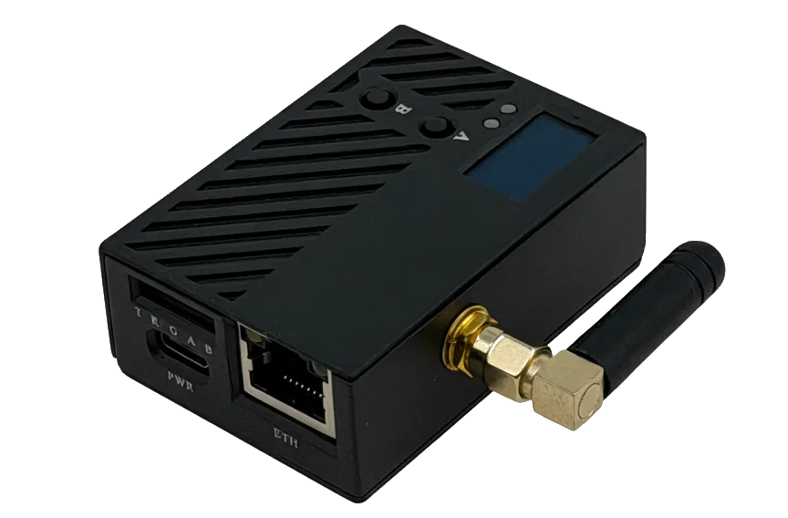

## 术语解释

| 术语 | 解释 |
|------|------|
| FlexKVM | FlexKVM设备 的简称，本文档中统一使用该简称 |
| 被控设备 | 需要被远程管理的设备，如电脑、服务器等 |
| 控制端 | 操控 FlexKVM 的设备 |

## 流程概览

快速上手的三个步骤：

> **开始前**：请先确认[包装清单](#包装清单)物品齐全，准备好[自备物品](#准备工作)，并[了解接口位置](#接口速览)。

| 步骤 | 操作 | 完成标志 |
|------|------|----------|
| 1. 接线启动 | 连接电源、USB、HDMI | OLED 显示设备状态界面，🟢 状态灯常亮 |
| 2. 网络配置 | 连接有线网络或配置 WiFi | OLED 显示设备 IP 地址，🔴 警告灯灭 |
| 3. 访问设备 | 浏览器打开设备 IP，创建账户 | 浏览器显示 FlexKVM 主界面 |

> 整个流程大约需要 5-8 分钟。

---

## 包装清单

打开包装后，请对照下表核对物品是否齐全：

| 编号 | 物品 | 数量 | 说明 |
|------|------|------|------|
| [1] | FlexKVM 主机 | 1 台 | 核心设备 |
| [2] | HDMI 连接线 | 1 条 | 连接被控设备视频输出 |
| [3] | USB Type-C 数据线 | 3 条 | 供电、数据传输与 ATX 控制。三条规格完全相同，可互换使用，长度 1 米，Type-A to Type-C |
| [4] | ATX 控制器 | 1 个 | 远程控制电脑电源开关 |
| [5] | ATX 杜邦线 | 10根 | ATX 控制器接线 |
| [6] | 磁吸背板 | 1 个 | 将设备固定在机柜上 |
| [7] | 说明书 | 1 份 | 产品使用说明 |

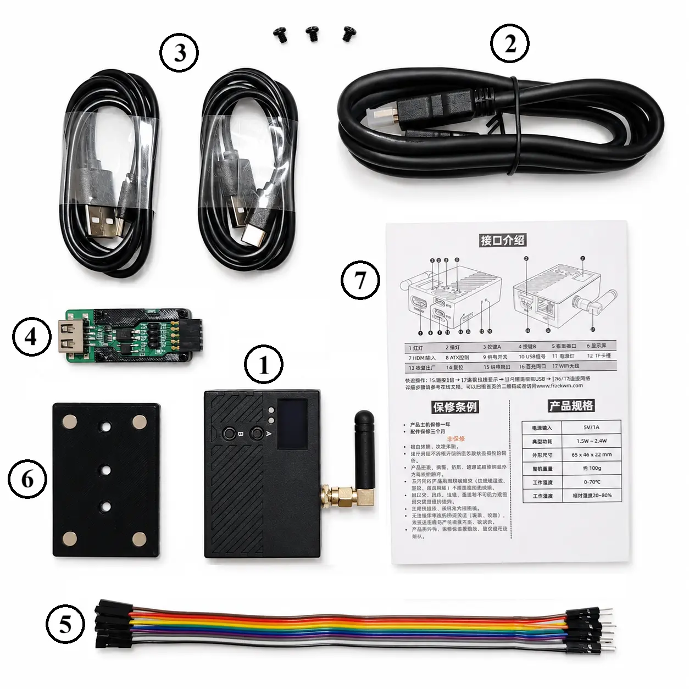

> 磁吸背板已预装在主机背面，开箱时确认即可。
>
> ATX 控制器和杜邦线用于远程开关机功能，快速上手阶段无需安装，后续可参考 [ATX 控制](../guide/peripherals/atx.md) 进行配置。

---

## 准备工作

除包装内的物品外，您还需要自备：

| 物品 | 用途 | 备注 |
|------|------|------|
| USB 电源适配器(5V/1A及以上) | 独立供电 | **推荐**，稳定性最佳 |
| 网线 | 有线联网 | 使用热点配网则不需要 |
| 正常开启的被控设备（电脑/服务器） | 被远程管理的目标设备 | 需具备 HDMI 输出和 USB 接口 |
| HDMI 转接头 | 适配非标准 HDMI 接口 | 若被控设备为 Mini HDMI / Micro HDMI 等非标准接口，**需自备转接头或转换线**，否则无法连接 |
| 控制端（可上网的电脑或手机） | 配置设备、远程访问 | 支持 Windows / macOS / Linux，浏览器推荐使用 Chrome / Edge |

> 没有 USB 电源适配器？您可以使用被控设备的 USB 端口供电，但被控设备关机后 FlexKVM 也会断电，无法远程开关机。
>
> 浏览器推荐使用 Chrome / Edge ，其他浏览器可能存在兼容性问题(比如说画面显示异常)。
>
> FlexKVM 和控制端（电脑/手机）需要处于**同一个局域网**（连接同一个路由器），否则无法通信。请在开始前确认您的网络环境。

---

## 接口速览

以下是快速上手过程中会用到的接口，了解它们的位置和用途即可。

| 编号 | 名称 | 说明 |
|:----:|------|------|
| [1] | 🔴 警告灯 | 反映网络和系统状态，详见下方速查表 |
| [2] | 🟢 状态灯 | 反映设备连接状态，判断设备是否正常工作的首要依据 |
| [3] | 按键 A | 长按 1~3 秒进入热点配网，超过 3 秒返回主界面 |
| [5] | HDMI 输入 | 连接被控设备的 HDMI 输出 |
| [7] | USB 供电开关 | 控制 USB 接口是否从被控设备取电 |
| [8] | USB 接口 | 连接被控设备，传输键鼠信号 |
| [9] | 🔴 电源灯 | 亮 = 已供电，灭 = 未供电 |

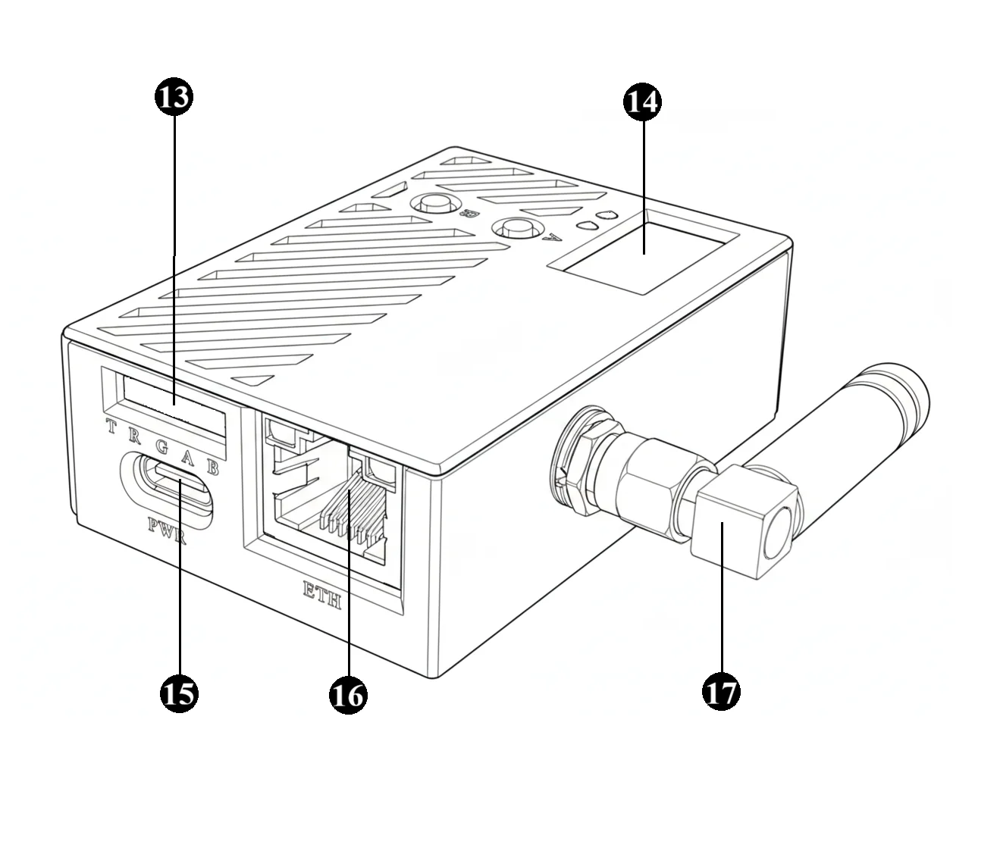

| 编号 | 名称 | 说明 |
|:----:|------|------|
| [14] | OLED 显示屏 | 显示设备状态、IP 地址、配网信息 |
| [15] | 电源接口 | 连接 5V 电源适配器 |
| [16] | 百兆网口 | 连接路由器或交换机 |
| [17] | WiFi 天线接口 | 天线出厂已安装，无需用户操作 |

> 编号 4、6、10~13 为按键 B、ATX 控制、TF 卡槽、恢复出厂、复位等接口，快速上手阶段无需使用，详见 [接口介绍](../guide/product/interface.md)。

### 状态灯速查表

🟢 状态灯 反映设备的连接状态:

| 状态 | 频率 | 含义 |
|------|------|------|
| 常灭 | — | 系统未正常启动 |
| 慢闪 | 1 次/秒 | **HDMI 未连接** 或 **被控设备休眠** |
| 快闪 | 4 次/秒 | **USB 未连接** 或 **被控设备关机** |
| 常亮 | — | HDMI和USB正常连接 |

> 优先级：快闪 > 慢闪 > 常亮。例如 USB 和 HDMI 都未连接时显示快闪；USB 正常但 HDMI 未连接时显示慢闪。
>
> 在连接过程中，请确保被控设备处于正常工作状态，被控设备关机或休眠可能会导致后面的步骤无法正常进行。
>
> 详细状态说明见 [LED 指示灯](../guide/interaction/led.md)。

### 警告灯速查表

🔴 警告灯 反映设备的网络和系统状态:

| 状态 | 频率 | 含义 | 您该怎么做 |
|------|------|------|-----------|
| 常灭 | — | 网络已连接，一切正常 | ✅ 正常，无需处理 |
| 慢闪 | 1 次/秒 | **网络未连接**或**处于热点配网模式** | ✅ 正常，配置网络后会自动熄灭 |
| 快闪 | 4 次/秒 | 紧急事件(ota升级，恢复出厂模式等) | ⚠️ 快速上手阶段不会出现这种状态 |
| 常亮 | — | 系统发生严重错误 | ❌ 重启设备，若仍常亮请联系技术支持 |

> 快速上手过程中，您会看到的状态只有 **慢闪** 和 **常灭**两种状态。
>
> 详细状态说明见 [LED 指示灯](../guide/interaction/led.md)。

---

## 接线启动

需要完成3个步骤：

> 设备通电后约需 20 秒启动，请耐心等待 OLED 亮起后再进行后续操作。

1. 连接电源
2. 连接 USB
3. 连接 HDMI

### 连接电源

取一根 **USB Type-C 数据线（包装编号 [3]）**，将 FlexKVM 的 **电源接口 [15]** 连接到 5V/1A 电源适配器。

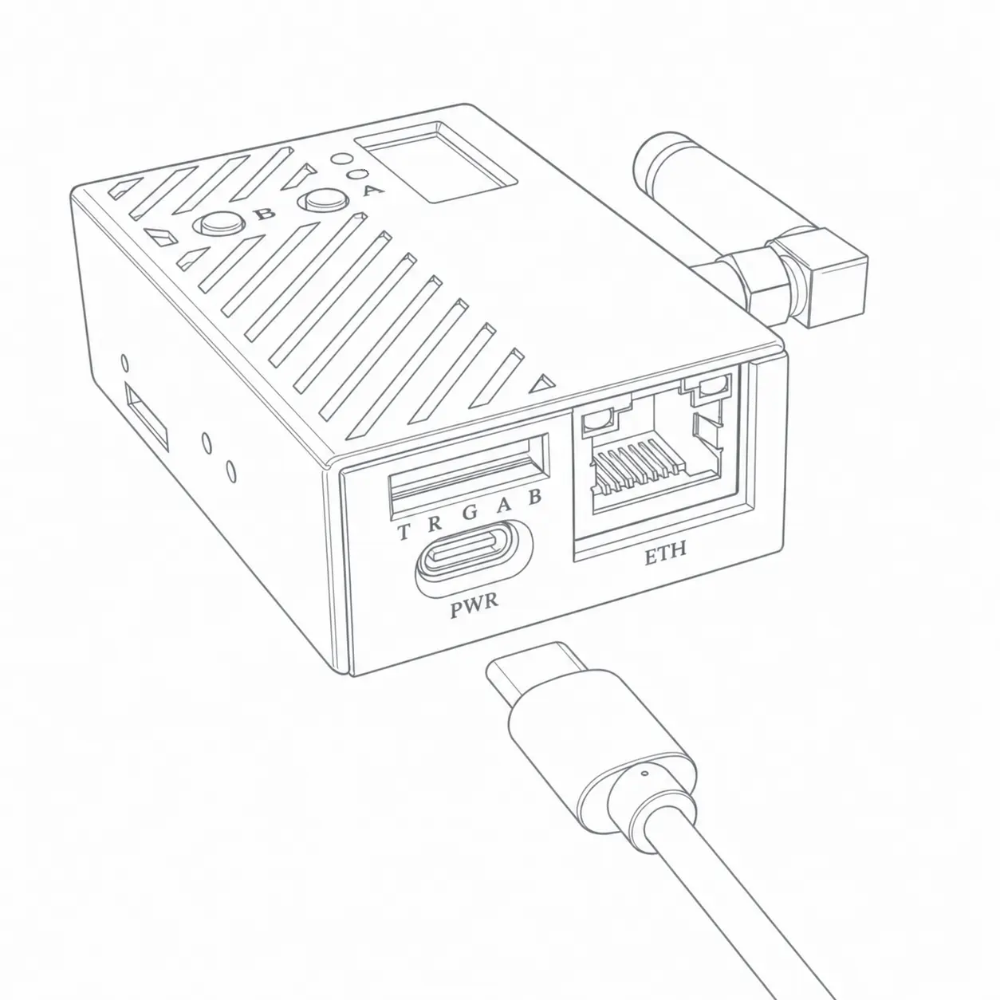

连接后：

- 🔴 **电源灯 [9] 常亮** 
- 约 2 秒后，**OLED 显示屏 [14]** 显示 "楚拓电子" logo

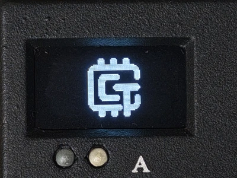

- 约 20 秒后（首次启动可能稍长，30 秒内属正常），OLED 进入设备状态界面
- 🟢 **状态灯 快闪**
- 🔴 **警告灯 慢闪**

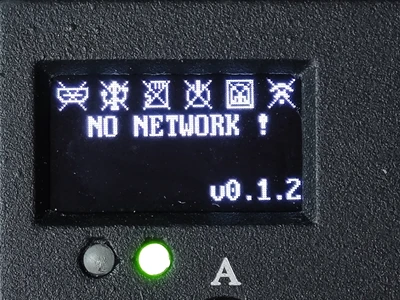

> 排查：如果 OLED 无显示或 🔴 电源灯 [9] 不亮，可能是电源适配器供电不足，请使用 5V/1A 以上的适配器。
>
> 没有电源适配器？临时方案：将 **USB 供电开关 [7]** 拨到 **I**（无需插入电源适配器），跳过此步，直接进入下一步连接 USB，设备会从被控设备取电启动。但被控设备关机后 FlexKVM 也会断电，无法远程开机。此后若准备了独立电源适配器，可直接接上电源适配器恢复独立供电。

### 连接 USB

取另一根 **USB Type-C 数据线（包装编号 [3]）**，将 FlexKVM 的 **USB 接口 [8]** 连接到被控设备的 USB 口。

> **USB 接口 [8] 插哪里？** 插被控设备**外部**的普通 USB 口（和插 U 盘、键盘一样），不需要拆机箱。FlexKVM 通过这个口模拟键盘鼠标。后面会用到的 ATX 接口 [6] 才是接主板**内部**插针的（用于远程开关机），快速上手阶段无需操作。

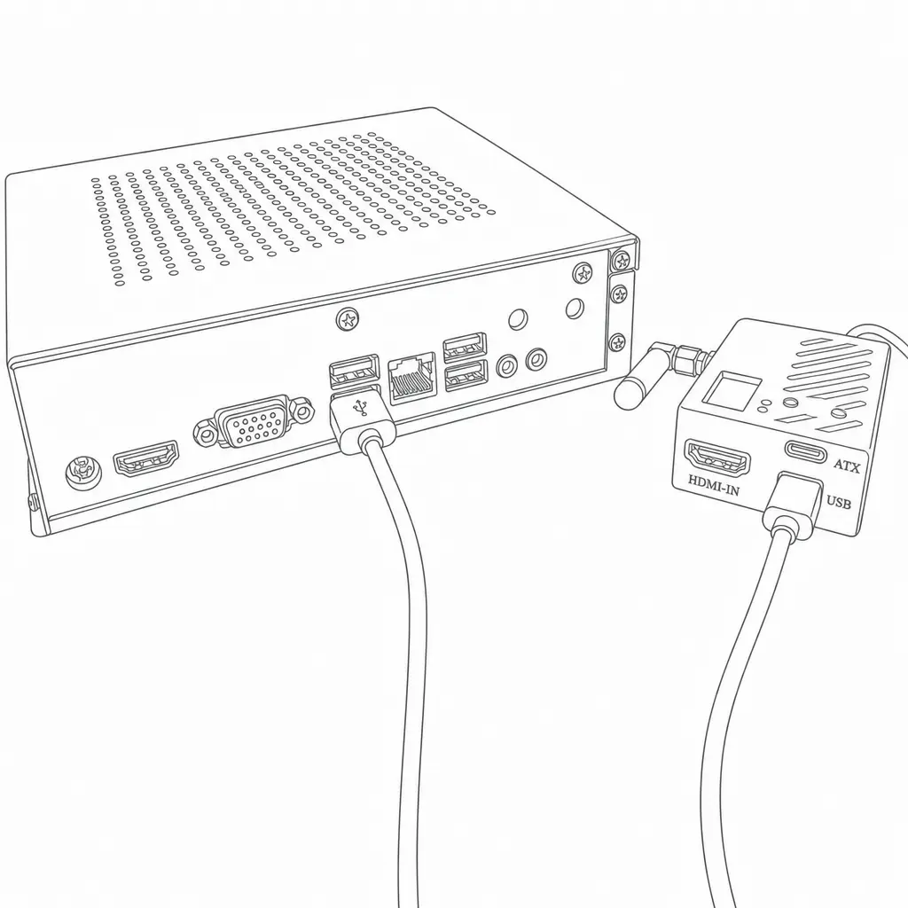

连接后：

- OLED 状态栏 :material-usb: USB 图标显示已连接（:material-close: 符号消失）
- 🟢 状态灯 从快闪变为**慢闪**

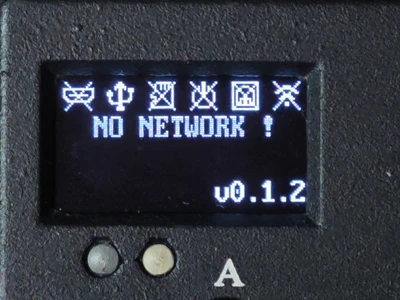

> 排查：如果 🟢 状态灯 仍为快闪，请检查被控设备是否已正常开机、USB 线材是否支持数据传输（包装内三根 USB Type-C 线均支持数据传输；若使用自备线材，请确认其为数据线而非仅充电线，部分仅充电线无法传输键鼠信号）。

### 连接 HDMI

使用 **HDMI 连接线（包装编号 [2]）** 连接被控设备的 HDMI 输出与 FlexKVM 的 **HDMI 输入 [5]**。

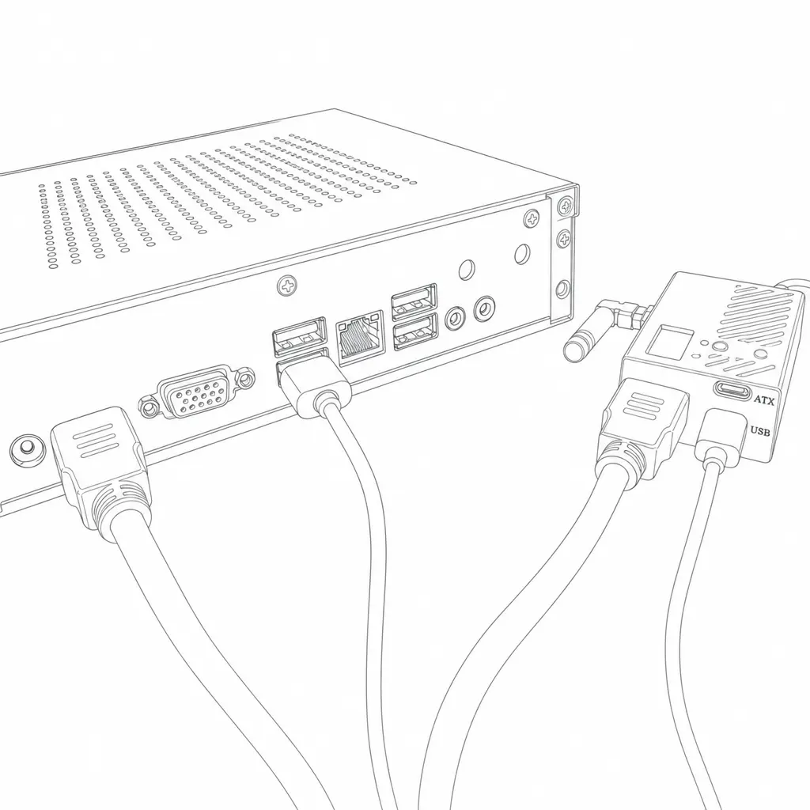

连接后：

- OLED 状态栏 :material-hdmi-port: HDMI 图标显示已连接（:material-close: 符号消失）
- 🟢 状态灯 从**慢闪**变为**常亮**

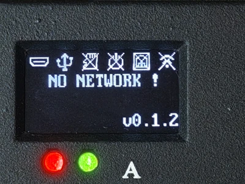

---

### 启动完成确认

完成全部接线后，设备应处于以下状态：

- 🔴 **电源灯 [9] 常亮**
- 🟢 **状态灯 常亮**
- 🔴 **警告灯 慢闪**
- **OLED 显示屏 [14]** 显示 :material-hdmi-port: HDMI、:material-usb: USB 连接成功

---

## 网络配置

> 设备在没有联网的情况下，🔴 **警告灯 慢闪**，OLED 第二行会显示"NO NETWORK !"。

网络配置完成之后设备:

- 🔴 **警告灯** 从**慢闪**变为**常灭**
- OLED 第二行显示 IP 地址

### 选择联网方式

根据现场**是否有路由器**，选择对应的联网方式：

| 环境 | 条件 | 可选方式 |
|:---:|------|------|
| **有网环境** | 有路由器 / 交换机 | 有线网络、热点配网 |
| **无网环境** | 无路由器 | 网线直连、AP 热点 |

#### 有网环境

FlexKVM 和控制端连接到**同一个路由器**，通过局域网通信。

| 方式 | 适用场景 | 操作 | 难度 |
|------|----------|------|:--:|
| 有线网络 | 有网线 | 插网线到路由器 | ⭐ |
| 热点配网 | 无网线 | 按按键 A，配 WiFi | ⭐⭐ |

#### 无网环境

FlexKVM 自己提供网络，电脑/手机直接连到设备即可。

| 方式 | 适用场景 | 操作 | 难度 |
|------|----------|------|:--:|
| 网线直连 | 电脑有网口 | 按按键 B，网线直连电脑 | ⭐ |
| AP 热点 | 手机 / 笔记本 | 按按键 B，连 FlexKVM WiFi | ⭐ |

---

### 有线网络

将网线一端连接路由器或交换机，另一端连接 FlexKVM 的**百兆网口 [16]**。

<!-- 截图待补充  -->

连接后：

- 网口灯亮起并闪烁
- OLED 状态栏网络图标启用，并显示 `waiting`
- 一般 **5 秒内**自动获取 IP 地址，OLED 显示 IP（如 `E192.168.1.100`，前缀 `E` 表示 Ethernet 有线网络；在浏览器访问时只需输入数字部分，如 `192.168.1.100`,将 192.168.1.100 替换为 OLED 显示的实际IP），🔴 **警告灯** 熄灭。

> **长时间未获取 IP 的排查步骤**：
>
> 1. 网口灯不亮 → 检查网线两端是否插紧、尝试更换网线
>
> 2. 网口灯亮但不闪烁 → 检查路由器端口是否正常、尝试更换端口
>
> 3. OLED 显示 `waiting` 超过 20 秒 → 确认路由器 DHCP 已开启、确认路由器 IP 地址池未耗尽
>
> 4. 以上均正常但仍无 IP → 尝试使用 [热点配网](#热点配网) 通过 WiFi 连接
>
> 5. 无 WiFi 环境 → 检查路由器 DHCP 设置，或参考 [网络设置](../guide/network/eth.md) 为 FlexKVM 配置静态 IP

---

### 热点配网

适用于没有网线、需要通过 WiFi 联网的场景。

#### 1. 进入配网模式

长按**按键 A [3]** 1~3 秒，OLED 显示 AP 图标后 :material-access-point: 松开，进入热点配网模式。

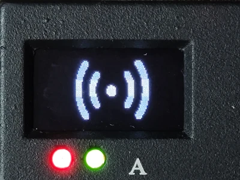

> 不到 1 秒不会触发；超过 3 秒则返回主界面。如果误操作，松开按键重试即可。

松开按键后，会进入配网等待界面:

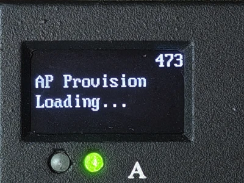

等待约 12 秒（设备正在生成 WiFi 热点，请耐心等待），OLED 会显示热点名称、密码和 IP 地址。

#### 2. 连接热点

使用手机或电脑搜索并连接 OLED 上显示的热点，输入显示的密码（8位随机数字）。

连接成功后：

- **手机**：系统会自动弹出浏览器门户页，点击即可进入配网页面
  - 如未弹出：手动打开浏览器访问 `http://192.168.10.1`
  - Android 用户也可在通知栏中点击"登录网络"来打开门户页
- **电脑**：手动打开浏览器，访问 `http://192.168.10.1`

> 手机/电脑连接 FlexKVM热点期间会暂时断开互联网连接，配网完成后自动恢复

##### 手机演示

首先，手机连接到 FlexKVM 的热点。

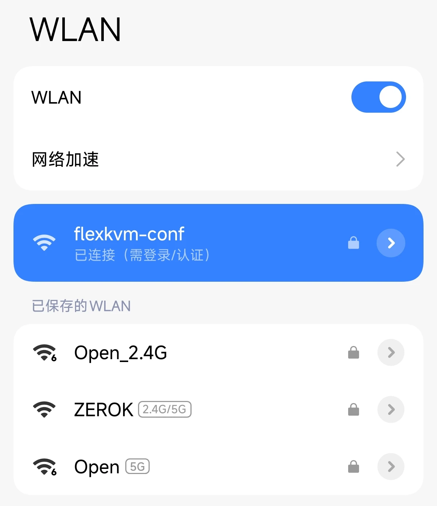

然后，手机会自动弹出浏览器门户页，点击"登录到WLAN网络"进入配网页面。

> 如未弹出，手动访问 `http://192.168.10.1` 即可。

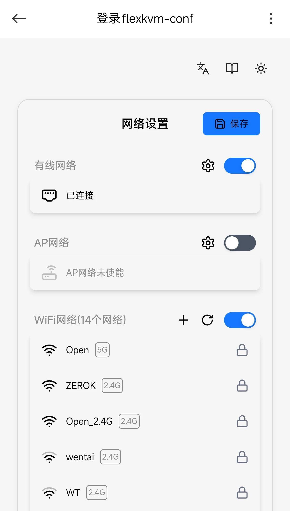

#### 3. 连接 WiFi

进入配网页面后，会自动扫描当前附近的wifi

> 点击 WIFI 卡片中的刷新按钮（🔄 图标），扫描可用 WiFi

在 **WIFI** 卡片中操作：

点击要连接的 WiFi，点击**连接**按键

如果wifi需要密码，输入密码后点击**连接**，（开放wifi会跳过输入密码的步骤）

连接成功后，wifi卡片会显示已连接

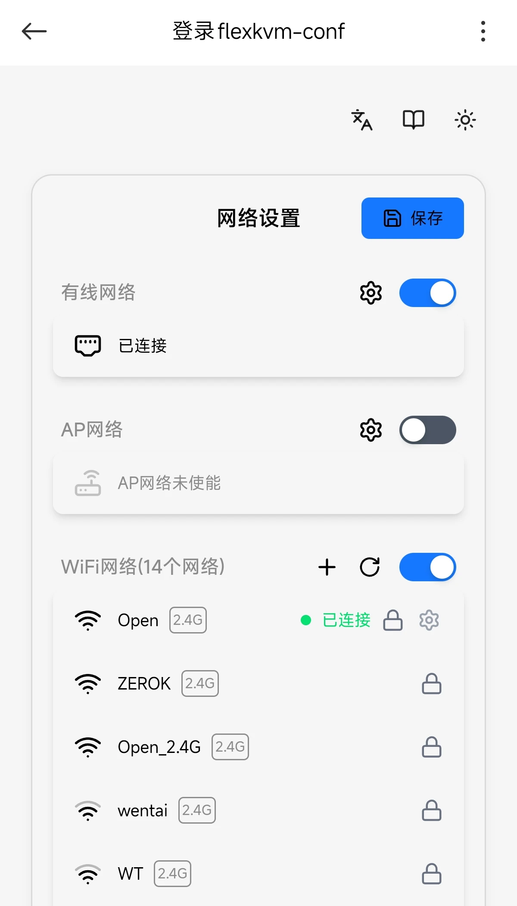

#### 4. 退出配网

点击页面右上角的**保存**按钮，设备自动退出配网模式并重启网络。

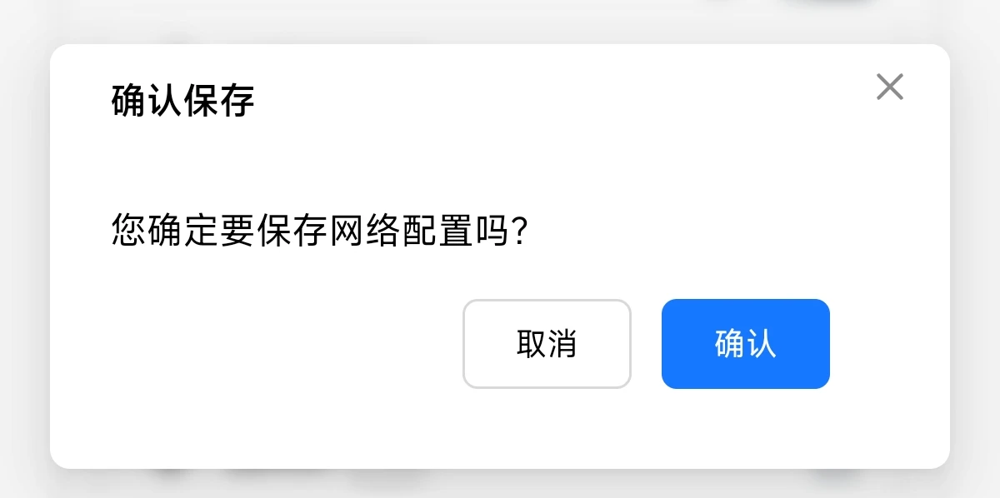

确认后，设备会自动退出配网模式并重启网络。

可以看到，设备已经获取到了IP地址，并且 🔴 警告灯 已经熄灭。

> ✅ **完成确认**：OLED 显示设备 IP 地址，🔴 警告灯 熄灭。

---

### 网线直连

用一根网线直接连接 FlexKVM 和电脑，无需路由器。

**1. 开启直连模式**

长按**按键 B [3]** 1~3 秒，OLED 显示 `ETH SERVER` 图标后松开。

> 不到 1 秒不会触发；超过 3 秒进入下一阶段（热点切换）；超过 5 秒返回主界面。如果误操作，松开按键重试即可。

**2. 连接电脑**

将网线一端连接 FlexKVM 的**百兆网口 [16]**，另一端连接电脑的网口。

连接后：

- 电脑自动获取 `192.168.100.x` 的 IP 地址（电脑网口需设为 DHCP 自动获取，通常默认已是）
- OLED 网络图标切换为直连图标，IP 前缀变为 **S**（如 `S192.168.100.1`），S = Server
- 🔴 **警告灯** 熄灭

**3. 访问设备**

在电脑浏览器中输入 `https://192.168.100.1`。

> **排查**：
>
> - 电脑拿不到 IP → 检查网线是否插紧、电脑网口是否设为 DHCP 自动获取
> - 拿到的 IP 不是 192.168.100.x → 电脑可能连着其他网络（如 WiFi），关掉电脑 WiFi 只保留有线
> - 能 ping 通但页面打不开 → 清浏览器缓存，或用无痕窗口试

**4. 退出直连模式**

再次长按**按键 B [3]** 1~3 秒，OLED 显示 `ETH CLIENT` 后松开，恢复普通以太网模式。

> 详细配置（修改网段、Web 界面开关等）见 [以太网直连模式](../guide/network/eth-server.md)。

---

### AP 热点

FlexKVM 自建 WiFi 热点，手机或笔记本直接连上来就能访问——无需路由器、无需网线。

**1. 开启热点**

长按**按键 B [3]** 3~5 秒，OLED 显示热点图标后松开。

> 按键 B 长按分三阶段：1~3 秒先闪过 `ETH SERVER`/`ETH CLIENT`（直连模式切换），忽略它继续按住，OLED 出现热点图标时松手即可。超过 5 秒则返回主界面。

**2. 连接热点**

使用手机或电脑：

- 搜索并连接 WiFi 热点 `FlexKVM-AP`
- 输入密码 `12345678`

连接后：

- OLED 显示热点图标，IP 前缀变为 **A**（如 `A192.168.10.1`），A = Access Point
- 🔴 **警告灯** 熄灭

**3. 访问设备**

在浏览器中输入 `https://192.168.10.1`。

> 热点模式下，手机/电脑连接 FlexKVM 热点期间会断开互联网。用完后记得关闭热点恢复网络。

**4. 退出热点**

再次长按**按键 B [3]** 3~5 秒，OLED 显示 WiFi 图标后松开，关闭热点恢复 WiFi 模式。

> 也可以在 Web 界面 → 设置 → **网络** → 热点模式卡片中关闭。
>
> 详细配置（修改 SSID、密码、频段等）见 [热点模式](../guide/network/ap.md)。

---

## 访问设备

### 浏览器访问

1. 在浏览器地址栏输入 `https://设备IP`（即 OLED 上显示的 IP 地址，例如 `https://192.168.1.100`）

> **不想记 IP？** 也可以用 mDNS 主机名访问：浏览器输入 `flexkvm-xxxx.local` 即可（主机名在 OLED 系统信息界面查看，详见 [mDNS 服务发现](../guide/network/mdns.md)）
2. 由于使用自签名证书，浏览器会提示"不安全"，请根据浏览器类型操作：

    | 浏览器 | 操作步骤 |
    |--------|----------|
    | Chrome | 点击"高级" → "继续访问（不安全）" |
    | Edge | 点击"高级" → "继续前往此站点（不安全）" |
    | Firefox | 点击"高级" → "接受风险并继续" |
    | Safari | 点击"显示详细信息" → "访问此网站" |
    | 移动端浏览器 | 操作路径与桌面端不同，通常点击"高级"或"详细信息"后即可继续访问 |

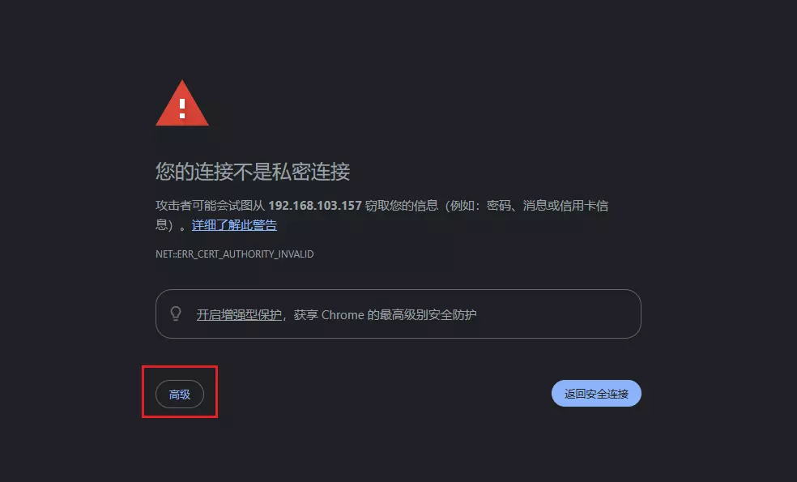

- 点击左下角的"高级"按钮

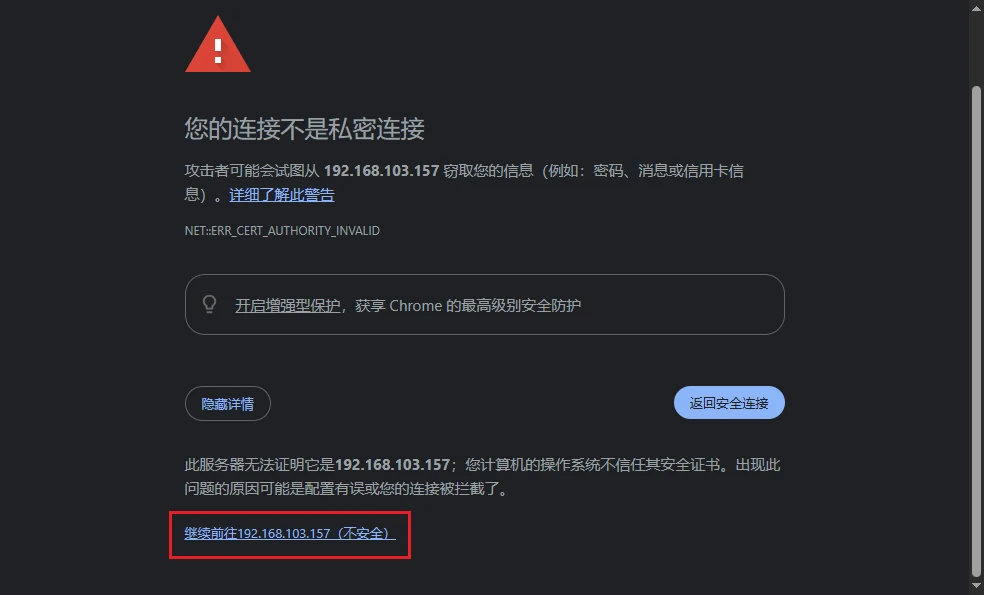

- 点击"继续访问（不安全）"或"接受风险并继续"

> **无法打开页面？** 如果浏览器提示"无法连接"或长时间加载：
>
> 1. 确认控制端和 FlexKVM 连接的是**同一个路由器**
>
> 2. 确认输入的 IP 地址与 OLED 显示的完全一致（注意 `https://` 前缀）
>
> 3. 尝试在控制端 ping 该 IP 地址，确认网络可达
>
> 4. 如果使用热点配网，确认手机/电脑仍连接在 FlexKVM 热点上，未自动切换回其他 WiFi
>
> 5. 尝试使用浏览器的无痕/隐私模式打开，排除浏览器缓存或 HSTS 设置干扰

### 首次创建账户

首次访问时需要创建管理员账户：

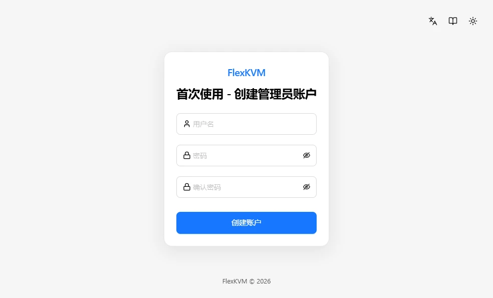

| 项目 | 要求 |
|------|------|
| 用户名 | 4-32 位，字母 / 数字 / 下划线 / 点 / 连字符 |
| 密码 | 8-32 位，可打印字符，无空格 |
| 确认密码 | 再次输入相同密码，确保两次输入一致 |

填写完成后点击"创建账户"，系统自动进入主界面。

> **创建失败？** 请检查：用户名是否包含不支持的特殊字符（仅允许字母、数字、下划线、点、连字符）；两次输入的密码是否一致；网络连接是否正常。

### 登录已有账户

如果已经创建过账户，直接输入用户名和密码登录。

> 如果开启了 **2FA**，需要额外输入验证码。

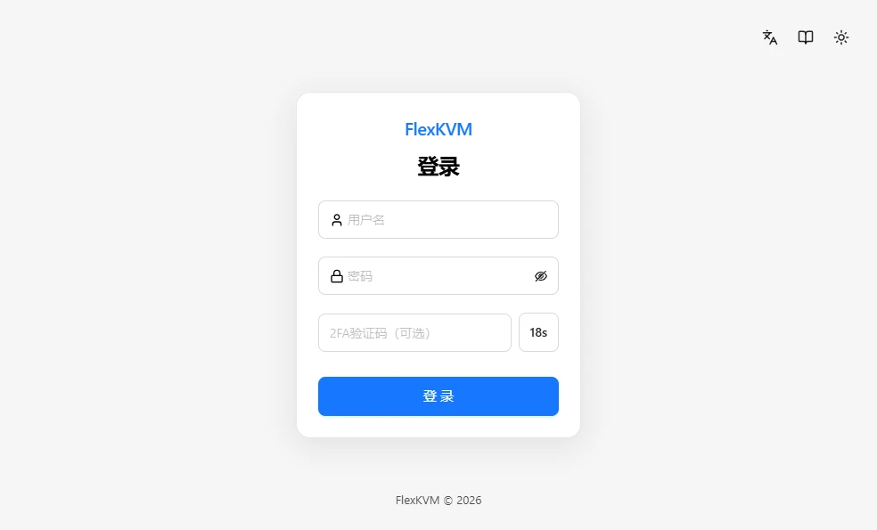

### 主界面

登录成功后即可看到 FlexKVM 主界面，开始远程管理您的被控设备。

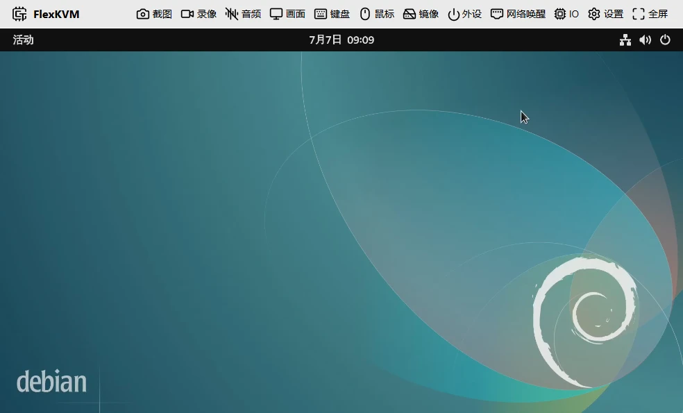

> 设备长时间断电后 RTC 时间可能错乱。设备时钟与当前时间偏差超过 60 秒时，登录后自动弹出校准提示，点"确认"将设备时间校准为当前时间，校准完成自动刷新登录凭证。

---

## 日常使用

完成首次设置后，日常使用非常简单：在控制端的浏览器中输入 `https://设备IP` 并登录即可。只要 FlexKVM 和被控设备保持通电和联网，无需重复配置。

---

## 下一步

完成基础设置后，建议按以下顺序继续：

1. **认识所有接口** → [接口介绍](../guide/product/interface.md)（了解设备全部功能，为后续配置打好基础）
2. **按场景深入** → [远程重装系统](../guide/scenarios/reinstall-os.md) · [外网访问](../guide/scenarios/remote-access.md) · [安全加固](../guide/scenarios/security.md)
3. **深入学习配置** → [用户指南](../guide/index.md)
4. **遇到问题** → [常见问题与排查](../support/index.md)
5. **加入社群** → [社区与联系](../community/index.md)
