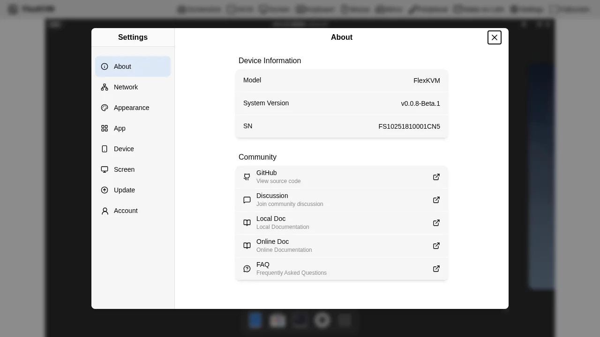
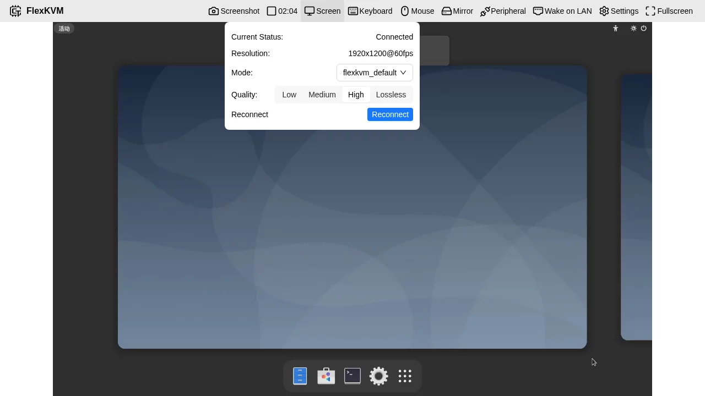
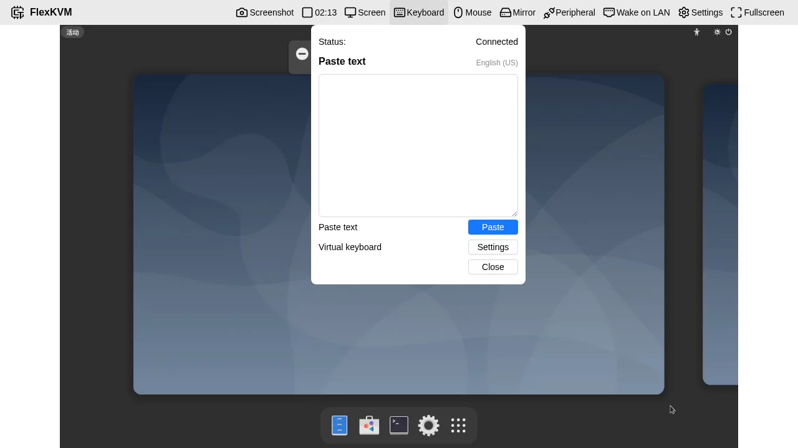
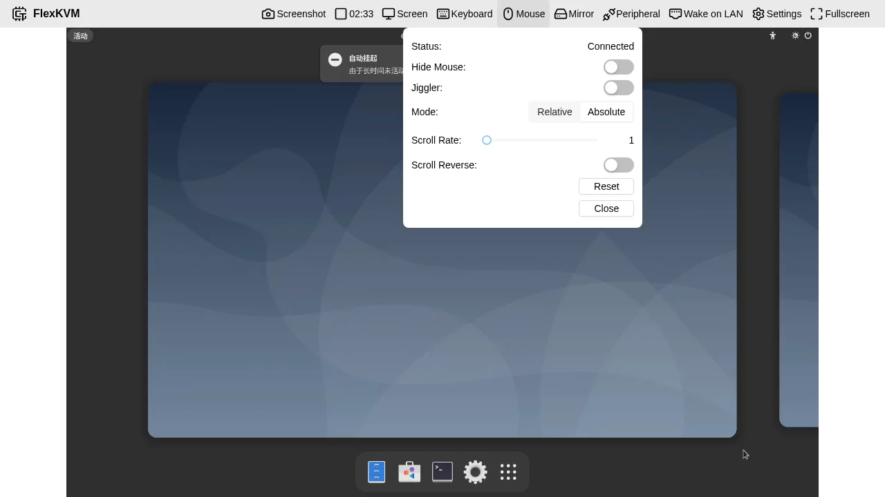
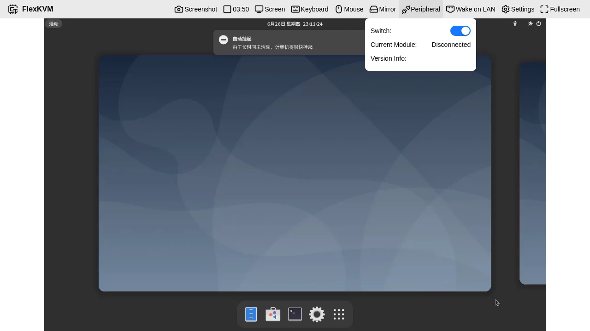

# User Guide

Welcome to the FlexKVM User Guide! This section will help you understand the various features of FlexKVM.

---

## Prerequisites

Before proceeding, we recommend learning about the detailed hardware configuration of the product.

[Product Introduction](../product/index.md)

---

## 1. Hardware Specifications

### 1.1 Core Parameters

| Parameter | Specification |
|-----------|--------------|
| Processor | High-performance encoding processor (256MB memory, SiP package, low power) |
| Network | Dual-band WiFi 6 (up to 300Mbps), 100Mbps Ethernet |
| Bluetooth | Bluetooth 5.4 (supports network configuration, future expansion) |
| HDMI Input | Up to 1920x1200@60fps support |
| Display | 0.77 inch monochrome OLED, 128x64 resolution |
| Power | USB 5V/1A |

### 1.2 Hardware Interfaces

| Interface | Quantity | Description |
|-----------|----------|-------------|
| HDMI IN | 1 | Video input |
| USB 2.0 | 2 | 1 data port, 1 power port |
| 100Mbps Ethernet | 1 | Wired network |
| ATX Port | 1 | USB form factor serial communication |
| TF Card Slot | 1 | Storage expansion |
| GPIO | 2 | 3.3V (reserved) |
| UART TTL | 1 | 3.3V (reserved) |

---

## 2. Network Configuration

### 2.1 Network Mode Comparison

| Mode | Pros | Cons | Use Case |
|------|------|------|----------|
| **Wired Network** | Stable, low latency | Requires cabling | Fixed installation environment |
| **WiFi Network** | Flexible, no cabling | Signal dependent | Office environment |
| **AP Mode** | Plug and play | No internet access | Temporary configuration |

### 2.2 Wired Network Configuration

Device defaults to DHCP for automatic IP acquisition. For static IP configuration:

1. Go to **Settings → Network → Wired Network**
2. Select Static IP mode
3. Fill in IP address, subnet mask, gateway, DNS
4. Click Save

### 2.3 WiFi Network Configuration

#### Scan and Connect

1. Go to **Settings → Network → WiFi Network**
2. Click "Scan" button
3. Select WiFi network from list
4. Enter password and click Connect

#### Manually Add Hidden Network

1. Go to WiFi settings page
2. Click "Add Hidden Network"
3. Enter SSID and password
4. Select security type (WPA2/WPA3)
5. Click Save

### 2.4 AP Mode (Hotspot)

AP mode is used for initial network configuration or emergency access when network fails.

**Enable Method:**

- Long press Button B for 3 seconds to switch to AP mode
- Or manually enable in settings

**AP Mode Parameters:**

- Default SSID: `FlexKVM_XXXX` (last 4 digits of device serial number)
- Default Password: See device label or OLED screen
- Management Address: `192.168.4.1`

### 2.5 Static IP vs DHCP

Go to **Settings → Network → Wired Network**:

- **DHCP**: Automatic IP address acquisition (recommended)
- **Static IP**: Manual network parameter configuration

For static IP, fill in:

- IP Address
- Subnet Mask
- Gateway
- DNS Server (optional)

---

## 3. Login

### 3.1 First Login

On first access, the system will guide you to create an administrator account:

| Field | Requirements |
|-------|-------------|
| Username | 4-32 characters, letters/numbers/underscore/dot/hyphen |
| Password | 8-32 characters, printable characters, no spaces |

### 3.2 Regular Login

After account creation, login requires:

- Username
- Password
- 2FA verification code (if enabled)

### 3.3 User Management

FlexKVM uses single-user design, currently supporting only one administrator user.

**Change Password:**

1. Go to **Settings → Account → Account Info**
2. Click "Change Password"
3. Enter old and new password
4. Confirm change

**2FA Two-Factor Authentication:**

1. Go to **Settings → Account → 2FA Verification**
2. Click "Generate 2FA"
3. Scan QR code with Authenticator App
4. Enter 6-digit verification code to complete binding

8-digit backup codes will be generated after enabling 2FA. Please copy and save immediately.

---

## 4. Feature Introduction

### 4.1 Main Interface

The main interface consists of:

- **Top Menu Bar**: Quick function access
- **Video Area**: Real-time display of controlled device
- **Status Bar**: Connection status and resolution information

### 4.2 Menubar Introduction

#### Screenshot Function

Click "📷 Screenshot" button:

- Save current frame as PNG image
- Auto-download to browser default directory

#### Recording Function

Click "🎥 Recording" button:

- Start/Stop video recording
- Video saved to TF card
- Support long-duration recording

#### Screen Settings

Click "🖥️ Screen" menu:

| Option | Description |
|--------|-------------|
| Quality | Low/Medium/High/Lossless |
| Reconnect | Re-establish video connection |
| Video Effects | Adjust brightness/contrast/saturation |

#### Keyboard Settings

Click "⌨️ Keyboard" menu:

| Option | Description |
|--------|-------------|
| Paste Text | Send English text to controlled device |
| Virtual Keyboard | Open on-screen virtual keyboard |

#### Mouse Settings

Click "🖱️ Mouse" menu:

| Option | Description |
|--------|-------------|
| Hide Mouse | Hide local mouse cursor |
| Jiggler | Auto-move to prevent controlled device sleep |
| Mode | Absolute/Relative mode |
| Scroll Reverse | Reverse scroll direction |
| Scroll Rate | Adjust scroll sensitivity |
| Reset | Restore default settings |

#### Peripheral Control

Click "⚡ Peripheral" menu:

| Button | Action |
|--------|--------|
| Power Short Press | Power on/Normal shutdown |
| Power Long Press | Force shutdown |
| Reset | Restart device |

### 4.3 Settings Introduction

#### Network Settings

**WiFi Network:**

- Scan and connect to WiFi
- Add hidden networks
- View saved networks

**Wired Network:**

- Enable/Disable wired network
- DHCP/Static IP switch
- Configure IP/Subnet Mask/Gateway/DNS

**AP Network:**

- Enable/Disable AP mode
- Configure SSID and password
- Set maximum client connections

#### Appearance Settings

**Theme:**

- Light mode
- Dark mode
- Auto (follow system)

**Accent Color:**

Options: Blue, Teal, Green, Gold, Orange, Red, Pink, Purple, Gray

**Language:**

- Simplified Chinese
- English

#### Device Settings

**OLED Settings:**

| Parameter | Range | Description |
|-----------|-------|-------------|
| Brightness | 0-100% | Screen brightness |
| Sleep Time | 10s-Never | Auto screen off after inactivity |

**Time Settings:**

- Auto-sync NTP server
- Manual timezone setting
- Support RTC hardware clock

**SSH:**

- Enable/Disable SSH service
- For command line debugging

**HTTPS:**

- Self-signed certificate (default)
- Custom certificate (upload PEM format)

**Log Management:**

- View system operation logs
- Download log archives
- Clear logs

**Event Log:**

- Record user operation events
- Support pagination view
- Exportable download

**Factory Reset:**

- Software reset (via settings page)
- Hardware reset (long press reset button)

**Reboot:**

- Soft reboot (safe restart)
- Hard reboot (power cycle - not recommended)

#### Screen Settings

**Custom EDID:**

For resolving graphics card compatibility issues:

1. Obtain target monitor's EDID data (hexadecimal)
2. Paste into EDID input box
3. Click Submit
4. Reconnect HDMI

**Video Effects Switch:**

Enable direct adjustment of brightness, contrast, saturation from main interface menu bar.

#### Account Settings

- Change password
- 2FA verification configuration
- Scratch card backup codes

#### Update Settings

**Online Update:**

1. Click "Check for Updates"
2. If new version available, changelog will be displayed
3. Click "Update Now"
4. Wait for download and installation completion

**Pioneer Program:**

Enable to receive beta version updates.

**TF Card Offline Update:**

1. Place `update_ota.tar` in TF card `/ota` directory
2. Insert TF card into FlexKVM
3. Go to TF Offline Update page
4. Click Start Update

**OTA Image Upload Update:**

1. Upload `.tar` firmware file (max 50MB)
2. System auto-verifies SHA256
3. Click upgrade after verification passes

#### Application Settings

**Tailscale:**

1. Go to **Settings → App → Tailscale**
2. Click "Login"
3. Complete Tailscale account authorization
4. Get Tailscale IP address

Access FlexKVM via Tailscale IP for remote access from anywhere.

---

## 5. Virtual Media (USB Gadget)

FlexKVM can emulate as USB device to provide storage functionality to controlled computer.

### Usage Steps

1. Go to **Settings → Device → USB Gadget**
2. Select mode:
   - CD-ROM: For system installation
   - Storage Device: For file transfer
3. Select or upload image file
4. Click "Mount"
5. Operate on controlled computer

### Custom Gadget

Support custom parameters:

- Vendor ID: 4-digit hexadecimal (e.g., 0x1234)
- Product ID: 4-digit hexadecimal (e.g., 0x5678)
- Manufacturer Name: Up to 64 characters (English)
- Product Name: Up to 64 characters (English)

---

## 6. Wake on LAN (WOL)

Wake controlled device remotely via network.

### Configuration Steps

1. Go to **Settings → Wake on LAN**
2. Add device:
   - Device Name (English)
   - MAC Address
3. Save configuration

### Usage

Click "🌐 Wake on LAN" in menu bar, select device to send wake packet.

---

## 7. Troubleshooting

### 7.1 Common Issues

**Cannot Access Web Interface**

1. Check if device is powered on
2. Confirm network connection is normal
3. Try accessing via IP directly
4. Check firewall settings

**Black Screen**

1. Check HDMI cable connection
2. Confirm controlled device has video output
3. Try replacing HDMI cable
4. Check if resolution is supported

**Mouse/Keyboard Not Responding**

1. Check USB Data cable connection
2. Try re-plugging USB cable
3. Switch mouse mode (Absolute/Relative)
4. Restart controlled device

**Network Connection Failed**

1. Check Ethernet/WiFi configuration
2. Confirm router DHCP is normal
3. Try static IP configuration
4. Check firewall rules

### 7.2 Get Help

- **GitHub Issues**: https://github.com/kalous12/FlexKVM/issues
- **Community**: https://github.com/kalous12/FlexKVM/discussions
- **FAQ**: [FAQ](../faq/index.md)

---

## Appendix

### A. Technical Specifications

| Item | Specification |
|------|--------------|
| Operating Temperature | 0°C ~ 50°C |
| Storage Temperature | -20°C ~ 70°C |
| Operating Humidity | 10% ~ 90% RH |
| Power Consumption | < 2W |
| Dimensions | 60mm × 50mm × 30mm |
| Weight | Approx. 50g |

### B. Browser Compatibility

| Browser | Minimum Version | Recommended Version |
|---------|-----------------|---------------------|
| Chrome | 90+ | Latest |
| Edge | 90+ | Latest |
| Firefox | 88+ | Latest |
| Safari | 14+ | Latest |

### C. Port Reference

| Port | Protocol | Usage |
|------|----------|-------|
| 443 | TCP | HTTPS Web Interface |
| 22 | TCP | SSH Remote Login |
| 41641 | UDP | Tailscale WireGuard |

---

**Document Version**: v1.0
**Applicable Firmware**: v0.0.8-Beta.1 and above
**Last Updated**: 2026-03-27
