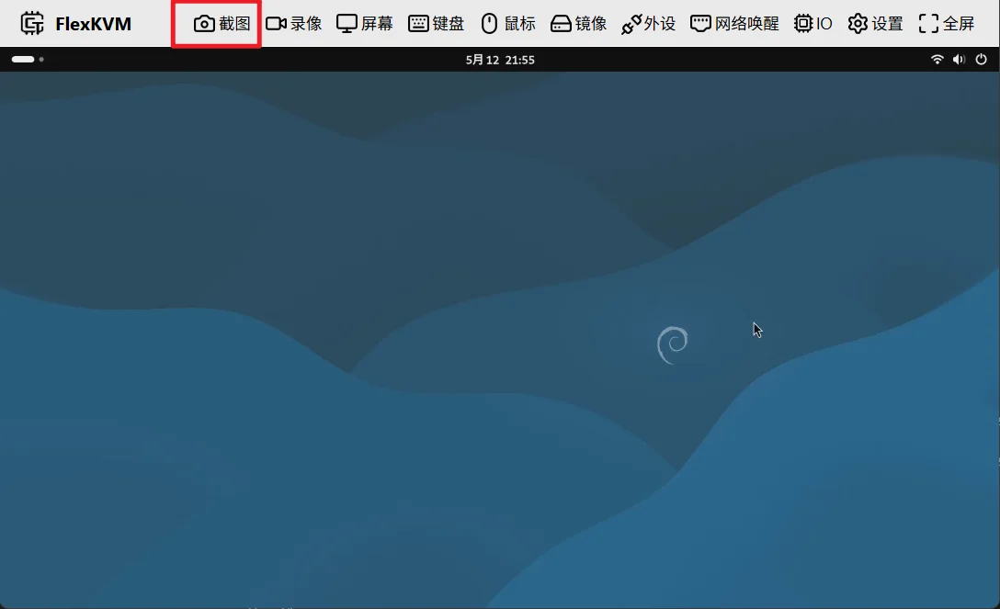

# 截图

点击主页面的截图按键后，会将整个屏幕截图到浏览器的下载目录中，文件的命名格式如下：flexkvm-screenshot-YYYY-MM-DDTHH-MM-SS.webp。

- YYYY-MM-DD：年-月-日
- HH-MM-SS：时-分-秒
- .webp：文件格式

例如：flexkvm-screenshot-2026-05-12T21-44-20.webp 表示在2026年5月12日21点44分20秒的截图。

