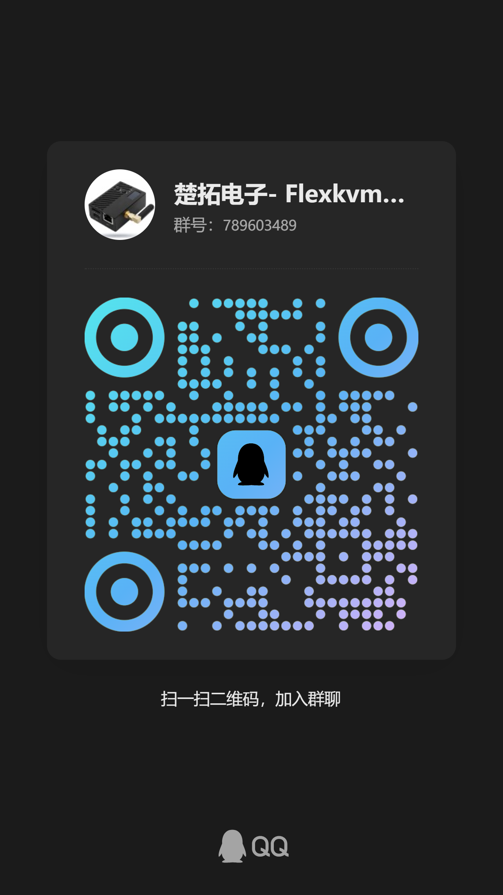

# FlexKVM

一款高效、灵活的 IP-KVM 解决方案，通过 HDMI+USB 实现完整的远程设备控制。

## 简介

FlexKVM 是一款即插即用的带外管理设备。将它接入目标主机的 HDMI、USB 和电源控制接口，即可通过浏览器或 Tailscale 网络随时随地查看屏幕、控制键鼠、开关电源、挂载 ISO —— 即使目标系统宕机、无显卡驱动、甚至未安装操作系统。

**核心优势：**
- 硬件级 HDMI 捕获，系统崩溃也能远程看屏
- WebRTC 双向音频：USB 模拟声卡，被控端声音传回浏览器，操作端麦克风输出至被控端
- 远程键鼠控制直达 BIOS/UEFI
- 内置 Tailscale 异地组网，无需公网 IP
- 双网冗余（WiFi 6 双频 + 百兆有线）
- WiFi 6 自建热点，无网络环境到手即用
- 低功耗静音设计（1.5W ~ 2.4W）

## 文档

| 文档 | 说明 |
|------|------|
| [产品介绍](https://flexkvm.com/latest/product/) | 功能特性、规格参数、适用场景 |
| [快速入门](https://flexkvm.com/latest/quick_start/) | 5 分钟快速上手指南 |
| [用户指南](https://flexkvm.com/latest/guide/) | 完整功能说明和配置教程 |
| [常见问题](https://flexkvm.com/latest/support/) | FAQ + 故障排查 |

## 更新日志

### Stable（稳定版）

- [Changelog (English)](Changelog/Stable/CHANGELOG.md)
- [更新日志 (中文)](Changelog/Stable/CHANGELOG_CN.md)

### Dev（开发版）

- [Changelog (English)](Changelog/Dev/CHANGELOG.md)
- [更新日志 (中文)](Changelog/Dev/CHANGELOG_CN.md)

## 购买

- [淘宝官方店铺](https://item.taobao.com/item.htm?id=1054030596204)

## 社区与支持

| 渠道 | 用途 |
|------|------|
| [GitHub Issues](https://github.com/chutuotek/flexkvm/issues) | Bug 反馈与功能建议，便于跟踪处理 |
| [GitHub Discussions](https://github.com/chutuotek/flexkvm/discussions) | 问题讨论与建议反馈 |
| [QQ 群：789603489](https://qm.qq.com/q/R5cNG8ARmW) | 国内用户实时交流 |
| [Telegram 群](https://t.me/flexkvm) | 海外用户交流 |
| [官方网站](https://flexkvm.com) | 更多产品信息 |

**扫码加入社群：**

| QQ 群 | 微信群 | 楚拓电子公众号 | Telegram 群 |
|-------|--------|-----------|------------|
|  |  |  |  |

反馈 Bug 时请附上系统版本、浏览器版本、问题描述与日志，格式参考[建议与反馈](https://flexkvm.com/latest/community/feedback/)。

## License

Copyright © 2026 ChuoTuoTEK